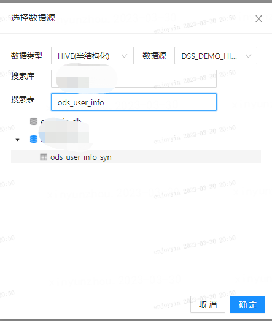
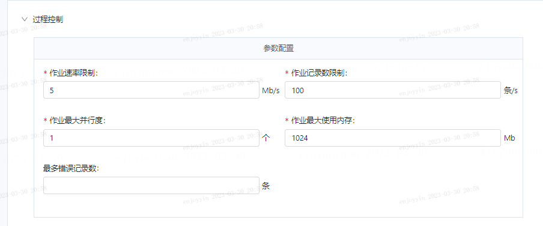
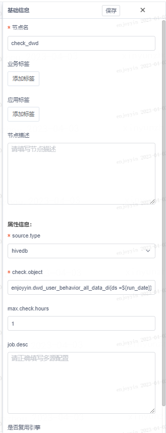

本文档主要面对数据开发工作人员，向您介绍离线数仓搭建的最佳实践，您可参考本文进行数仓开发，了解如何利用DSS进行离线数仓建设。

# 背景信息

## 项目背景：

本实践以某电商app为例，通过埋点采集用户在app内的行为数据，结合用户基本信息数据，构建用户行为分析数仓，对用户在app内的浏览和购买行为及偏好进行分析。

## 前置学习：

**1、[DSS快速入门](./DSS快速入门.md)**

**2、[Scriptis数据导入](../产品使用指南/Scriptis/数据导入.md)**

# 操作步骤

**整体流程说明：**


## 数据采集

在本实践的场景中，用户信息数据和日志数据均存储在mysql中，因此需要将数据同步到hive中。

### **1、新建项目和工作流**

1）新建项目：进入dss首页，进入部门工作空间，点击➕，填写项目名称和描述，即完成项目的创建。这里我们以”demo_user_behavior_analysis“为名创建项目。


2）新建工作流：在”demo_user_behavior_analysis"项目下，新建数仓工作流，命名为demo;


### 2、设计工作流

进入工作流流程开发面板，鼠标单击“connector”节点并拖拽至右侧编辑区域，命名为“start”节点，标志着工作流的开始。connector节点没有实际含义，主要是为了工作流的美观，您可以根据个人操作习惯来选择。


接下来，鼠标单击“datax节点”并拖拽至以同样的方式新建两个数据同步节点。


为了确保数据完全被同步到库中，可增加两个”datachecker”节点：datachecker节点用于检测数据是否ready，可以判断hive库中某个表或者分区是否存在，如果存在则进行下游的执行，在有数据依赖的任务中扮演十分重要的作用，用于替换掉以前口头约定好的时间开始运行。


### 3、新建表

此处需要新建两张表，用于存储同步过来的用户信息表和日志信息表。

新建ods_user_info_syn表，dss提供两种方式建表，一种是DDL建表，另一种是建表向导；这里使用建表向导的方式进行建表：

1）进入Scriptis,点击数据库/表，点击右侧导航栏右上角➕；

2）在**建表向导**对话框中，输入表名等信息；点击**下一步**，填写表字段和字段类型等信息，点击保存。


| 配置项   | 取值              |
| :------- | :---------------- |
| 数据库名 | **                |
| 表名     | ods_user_info_syn |
| 表别名   | ods_user_info_syn |
| 分区类型 | 分区              |
| 生命周期 | 永久              |
| 模型层级 | ods（原始数据层） |
| 使用方式 | 增删改查          |

表字段：


| 字段            | 字段类型 |
| :-------------- | :------- |
| user_id         | string   |
| age             | int      |
| gender          | string   |
| VIP_level       | string   |
| country         | string   |
| province        | string   |
| city            | string   |
| user_name       | string   |
| phone           | string   |
| first_ad_source | string   |
| device_id       | string   |

DDL语句如下：

```sql
create table if not exists db(替换为有权限的数据库).ods_user_info_syn(
  user_id string,
  age int,
  gender string,
  VIP_level string,
  country string,
  province string,
  city string,
  user_name string,
  phone string,
  first_ad_source string,
  device_id string
) partitioned by(ds string) stored as orc
```

3）生成建表任务，待建表任务运行成功时，则表明表已创建成功。

**新建ods_user_log_syn表**，这里我们使用DDL语句建表：

操作步骤：scriptis - 进入工作目录下/创建新目录 - 新建脚本，选择spark sql脚本引擎 -输入DDL语句 - 运行。

```sql
create table if not exists db(替换为有权限的数据库).ods_user_log_syn(
  id string,
  user_id string,
  time date,
  event_name string,
  page_name string,
  button_name string,
  os string,
  is_wifi string,
  device_id string,
  app_version string,
  product_id string,
  order_id string,
  product_type string,
  product_name string,
  order_number int,
  price int,
  amount int
) partitioned by(ds string) stored as orc
```


### 4、编辑工作流节点

#### **1）编辑datax 节点**

**操作步骤：**创建项目 - 选择源数据源(mysql) - 选择目的数据源(hive) - 配置源表的筛选条件和目标表的写入条件 - 源表和目标表的字段映射 - 配置任务运行参数 - 配置执行代理用户

**编辑ods_user_info_syn节点**

在工作流开发页面，双击”ods_user_info_syn“节点，进入节点配置页面。

a.创建项目


b.选择源数据源


c.选择目的数据源



d.配置源表的筛选条件和目标表的写入条件


e.源表和目标表的字段映射


f.配置任务运行参数


g.配置执行代理用户


**编辑ods_user_log_syn节点**

在工作流开发页面，双击”ods_user_log_syn“节点，进入节点配置页面。

细节如下：




#### 2）编辑datachecker节点

**操作步骤：**单击节点，并在右侧配置卡中完成datachecker的配置。

**配置ods_user_info_syn表的检查节点：**


| 字段名          | 取值                                       | 描述                                                       |
| :-------------- | :----------------------------------------- | :--------------------------------------------------------- |
| 节点名          | check_info                                 | 自定义节点名                                               |
| source_type     | hive_db                                    | 指定节点检查的数据源类型，目前支持hive_db和mask_db这两种。 |
| check_object    | enjoyyin.ods_user_info_syn{ds=${run_date}} | 指定检查的表和分区信息；                                   |
| max.check.hours | 1                                          |                                                            |
| 是否复用引擎    | true                                       |                                                            |


**配置ods_user_log_syn表的检查节点：**


| 字段名          | 取值                                      | 描述                                                       |
| :-------------- | :---------------------------------------- | :--------------------------------------------------------- |
| 节点名          | check_log                                 | 自定义节点名                                               |
| source_type     | hive_db                                   | 指定节点检查的数据源类型，目前支持hive_db和mask_db这两种。 |
| check_object    | enjoyyin.ods_user_log_syn{ds=${run_date}} | 指定检查的表和分区信息；                                   |
| max.check.hours | 1                                         |                                                            |
| 是否复用引擎    | true                                      |                                                            |

### 5、运行节点

选择”执行“，则开始运行当前工作流。当工作流的状态从时间倒计时变成绿色的，则代表成功同步数据。

## 数据加工

任务描述：对于贴源层的数据进行数据加工，生成明细层（DWD层）和汇总层（DWS层）的数据表，以实现用户行为分析的目的；

### **1、新建表**

此处需要创建两张表，分别是明细层（DWD层）和汇总层（DWS层）。

新建dwd层表

操作步骤：scriptis - 进入工作目录下/创建新目录 - 新建脚本，选择spark sql脚本引擎 -输入DDL语句 - 运行。

```sql

create table if not exists db(替换为有权限的数据库).dwd_user_behavior_all_data_di
(
time date,
uid string,
age string,
gender string,
VIP_level string,
country string,
province string,
city string,
first_ad_source string,
user_event string,
order_id string,
product_id string,
product_name string,
product_type string,
order_cnt int,
amount double
) partitioned by(ds string) stored as orc

```

新建dws层表

操作步骤：scriptis - 进入工作目录下/创建新目录 - 新建脚本，选择spark sql脚本引擎 -输入DDL语句 - 运行。

```sql
create table if not exists db(替换为有权限的数据库).dws_user_behavior_stats_di
(
time date,
uid string,
age string,
gender string,
VIP_level string,
country string,
province string,
city string,
first_ad_source string,
--浏览首页次数
page_sum string,
--浏览商详页次数
detail_page_sum string,
--进入支付页次数
purchase_page_sum string,
--订单量
order_cnt string,
--消费金额
money_sum string
)
partitioned by (ds string) stored as orc
```


### 2、设计工作流

此处需要新建两个SQL节点，依次命名为**dwd_user_info_all_d**和**dws_user_stats_d**，

为确保数据质量，此处需要在**dwd_user_info_all_d**节点和**dws_user_stats_d**节点后均新增一个datachecker节点，确保数据被写入到数据库中。


### 3、编辑spark sql节点

#### 1）dwd数据同步节点

双击“**dwd_user_info_all_d**”节点，在跳转的脚本编辑页面输入sql:

```sql

insert overwrite table db(替换为有权限的数据库).dwd_user_behavior_all_data_di partition (ds = ${run_date})
select 
l.time,
l.user_id uid,
-----用户信息数据
age,
gender,
VIP_level,
country,
province,
city,
first_ad_source,
----日志数据
case when event_name = 'page_view' and page_name = '首页' then '浏览首页' 
when event_name = 'page_view' and page_name = '商品详情页' then '浏览商详页'
when event_name = 'buy_now' and page_name = '支付页' then '购买'
when event_name = 'click_button' and button_name = '立即购买' then '点击立即购买'
else null end user_event,
order_id,
product_id,
product_name,
product_type,
order_cnt,
amount
from 
-- 用户信息数据
(select 
user_id u_id,
case when cast(age as int) <= 18 then '18岁及以下' 
when cast(age as int) >18 and  cast(age as int) <= 23 then '19-23岁'
when cast(age as int) >23 and  cast(age as int) <= 30 then '24-30岁'
when cast(age as int) >30 and  cast(age as int) <= 40 then '31-40岁'
when cast(age as int) >40 and  cast(age as int) <= 50 then '41-50岁'
when cast(age as int) >50 and  cast(age as int) <= 60 then '51-60岁'
when cast(age as int) >60  then '61岁以上' else null end age,
gender,
VIP_level,
country,
province,
city,
first_ad_source
from
db(替换为有权限的数据库).ods_user_info_syn
) i
inner join 
-- 日志行为数据
(select 
user_id,
time,
event_name,
page_name,
button_name,
order_id,
product_id,
product_name,
product_type,
order_number order_cnt ,
amount
from 
db(替换为有权限的数据库).ods_user_log_syn
where 
event_name in ('page_view','buy_now','click_button')
and page_name in ('首页','商品详情页','支付页')
and date_format(time, 'YYYYmmdd') = ${run_date}
) l 
on i.u_id = l.user_id 
```

#### 2）dws数据同步节点

双击“**dws_user_stats_d**”节点，在跳转的脚本编辑页面输入sql:

```sql
insert overwrite table dws_user_behavior_stats_di partition (ds = ${run_date})

select 
time,
uid,
-----用户信息数据
age,
gender,
VIP_level,
country,
province,
city,
first_ad_source,
----统计数据
--浏览首页次数
sum(case when user_event = '浏览首页' then 1 else null end) page_sum,
--浏览商详页次数
sum(case when user_event = '浏览商详页' then 1 else null end) detail_page_sum,
--点击立即购买次数
sum(case when user_event = '点击立即购买' then 1 else null end) click_purchase_sum,
--订单量
count (distinct case when order_id is not null then 1 else null end) order_cnt,
--消费金额
sum(case when amount is not null then amount else null end ) money_sum
from 
db(替换为有权限的数据库).dwd_user_behavior_all_data_di a
where date_format(time, 'YYYYmmdd') = ${run_date}
group by 
time,
uid,
age,
gender,
VIP_level,
country,
province,
city,
first_ad_source
```

### 4、配置datachecker节点




### 5、工作流调试与发布

**操作步骤：**

1、点击“选中执行”，完成单工作流节点的调试；

2、单工作流节点调试完成后，点击“执行”，运行整个工作流。

3、当工作流执行完成后，点击发布，将工作流发布到调度中心。


### 

### 6、工作流调度

操作路径：点击“前往调度中心”，在调度中心根据生产需求配置调度间隔时长。 ->进入schedulis执行工作流；或选择“调度工作流”，对调度方式进行更精细的配置。


以上，我们就完成了离线数仓的工作流搭建。
