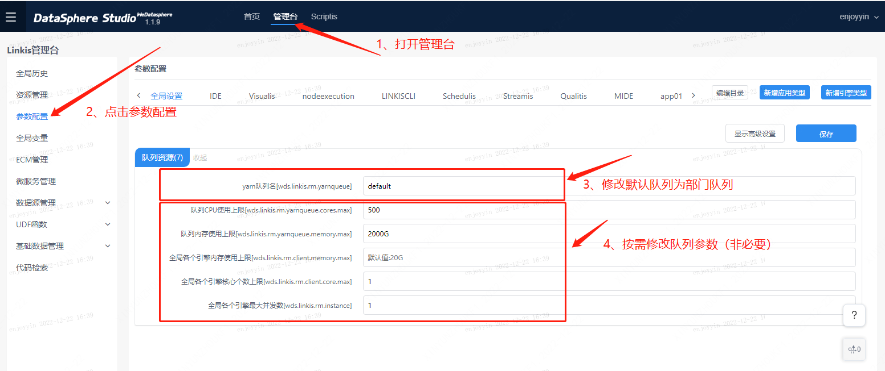
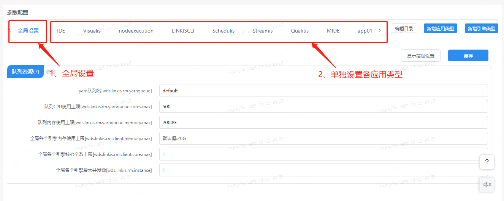
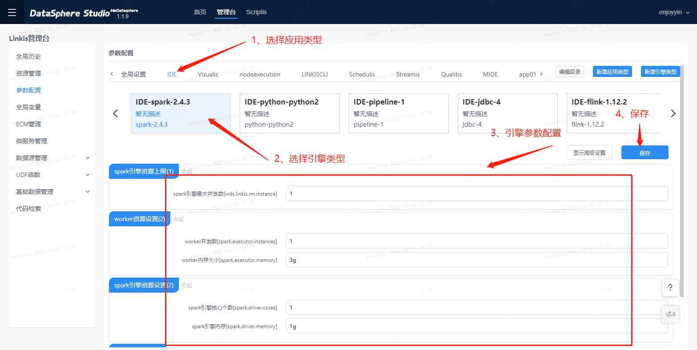

# 管理台资源参数配置

本文档面向新人用户，旨在通过文档引导帮助新人用户完成队列参数的初始化配置。   
队列参数的初始化配置主要分成两个步骤，设置队列和设置队列的资源参数。
## 1、设置队列
新人用户首先需要将默认队列修改为部门队列，操作路径为打开管理台-点击参数配置-修改默认队列为部门队列。  

## 2、设置队列的资源参数
新人用户可按需配置资源参数。当前队列资源参数的设置支持设置全局和设置单个应用类型；其中单应用类型设置的优先级大于全局设置；
1. 全局设置： 全局设置主要是对队列资源的参数进行配置，配置后对所有应用任务生效。
   
2. 单应用类型设置：单应用类型设置支持对应用类型和引擎类型进行个性化配置。可根据需求调整对应的参数。   
   其中应用类型指任务的提交入口，比如通过scriptis提交的任务，则在IDE应用类型设置，如果通过工作流实时执行提交的任务，则在nodeexcution应用类型中设置。引擎类型是指任务类型，如spark任务、hive任务。不同类型的工作流节点及scriptis脚本所产生的任务，会在不同的引擎类型上运行。   
   举个例子，如图所示，即为设置应用类型为IDE（即scriptis) 、引擎类型为spark的资源参数；   
   为确保您的配置不挤占其他用户的队列资源，建议保留默认配置。在默认配置不够用的情况下，按需增加资源参数。
   