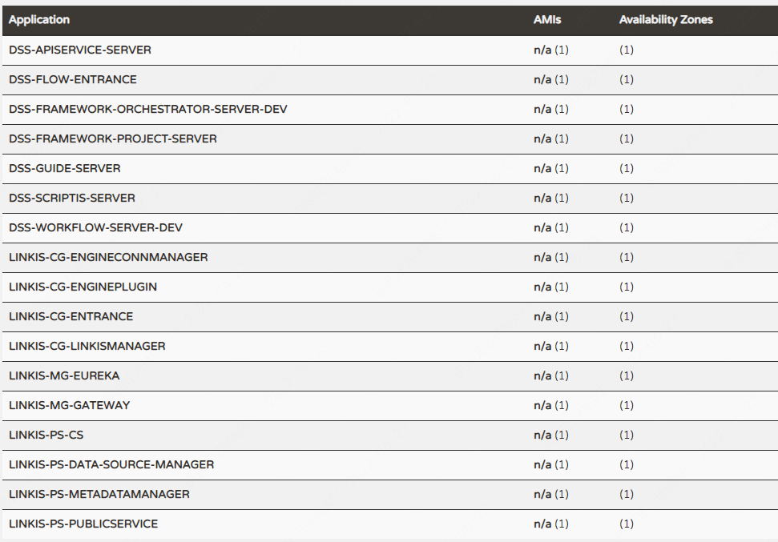

# DataSphere Studio & Linkis 单机一键部署文档


### 一、基础软件安装

- 需要的命令工具（在正式安装前，脚本会自动检测这些命令是否可用，如果不存在会尝试自动安装，安装失败则需用户手动安装以下基础shell命令工具）：

  *telnet; tar; sed; dos2unix; mysql; yum; java; unzip; zip; expect*


- 需要安装的软件：

  MySQL (5.5+); JDK (1.8.0_141以上); Python(2.x和3.x都支持); Nginx


- 下面的服务必须可从本机访问：

  Hadoop(**2.7.2，Hadoop其他版本需自行编译Linkis**) ，安装的机器必须支持执行 `hdfs dfs -ls /` 命令

  Hive(**2.3.3，Hive其他版本需自行编译Linkis**)，安装的机器必须支持执行`hive -e "show databases"`命令

  Spark(**支持2.0以上所有版本**) ，安装的机器必须支持执行`spark-sql -e "show databases" `命令


- Tips:

  如用户是第一次安装Hadoop，单机部署Hadoop可参考：[Hadoop单机部署](https://hadoop.apache.org/docs/r2.7.2/hadoop-project-dist/hadoop-common/SingleCluster.html) ；分布式部署Hadoop可参考：[Hadoop分布式部署](https://hadoop.apache.org/docs/r2.7.2/hadoop-project-dist/hadoop-common/ClusterSetup.html)

  如用户是第一次安装Hive，可参考：[Hive快速安装部署](https://cwiki.apache.org/confluence/display/Hive/GettingStarted)

  如用户是第一次安装Spark，On Yarn模式可参考：[Spark on Yarn部署](https://spark.apache.org/docs/2.4.3/running-on-yarn.html)

### 二、创建用户

1. 假设**部署用户是hadoop账号**（可以不是hadoop用户，但是推荐使用Hadoop的超级用户进行部署，这里只是一个示例）


2. 在所有需要部署的机器上创建部署用户，用于安装 ，如下命令创建部署用户hadoop

   ```shell
   sudo useradd hadoop
   ```

3. 因为Linkis的服务是以 `sudo -u ${linux-user}` 方式来切换引擎，从而执行作业，所以部署用户需要有 sudo 权限，而且是免密的，按下面步骤修改部署用户权限

   编辑/etc/sudoers文件：

   ```shell
   vi /etc/sudoers
   ```

   在/etc/sudoers文件中添加下面内容：

   ```
   hadoop  ALL=(ALL)  NOPASSWD: NOPASSWD: ALL
   ```

4. 确保部署 DSS 和 Linkis 的服务器可正常执行 hdfs 、hive -e 和 spark-sql -e 等命令。在一键安装脚本中，会对组件进行检查。


5. **如果用户的Pyspark想拥有画图功能，则还需在所有安装节点，安装画图模块**。命令如下：

   ```shell
   python -m pip install matplotlib
   ```

### 三、准备安装包

- 用户可以自行编译或者去 release 页面下载安装包：[DSS Release-1.1.0](https://github.com/WeBankFinTech/DataSphereStudio/releases/tag/1.1.0)

  **请注意：为了能正常使用 Visualis1.0.0 和 Exchangis1.0.0，请去 releases 页面下载最新的一键安装部署包。**

  **请注意：为了能正常使用 Visualis1.0.0 和 Exchangis1.0.0，请去 releases 页面下载最新的一键安装部署包。**


- DSS & Linkis 一键安装部署包的层级目录结构如下：

    ```text
    ├── dss_linkis # 一键部署主目录
      ├── bin # 用于一键安装，以及一键启动 DSS + Linkis
      ├── conf # 一键部署的参数配置目录
      ├── wedatasphere-dss-x.x.x-dist.tar.gz # DSS后端安装包
      ├── wedatasphere-dss-web-x.x.x-dist.zip # DSS前端和Linkis前端安装包
      ├── wedatasphere-linkis-x.x.x-dist.tar.gz # Linkis后端安装包
    ```

- 如果用户选择采用下载安装包直接部署的形式，可直接跳转到 [修改配置](#1)


- 如果用户选择自行编译 Linkis 或 DSS，请确保编译的是 Linkis1.1.1 和已拉取了 DSS `master` 分支的最新代码，编译方式可以参考:  
  [DSS后端编译文档](../开发文档/DSS编译文档.md)  
  [DSS前端编译文档](../开发文档/前端编译文档.md)  
  [Linkis后端编译文档](https://linkis.apache.org/zh-CN/docs/latest/development/linkis_compile_and_package)  
  [Linkis前端编译文档](https://linkis.apache.org/zh-CN/docs/latest/development/web_build)


        1. 针对后端安装包可直接将上面的 Linkis 后端安装包或 DSS 后端安装包替换成编译后相关安装包即可。

        2. 针对前端安装包，则需要特别注意，整个前端安装包目录结构如下：
        ```
        ├── wedatasphere-dss-web-x.x.x-dist # DSS和Linkis前端安装包
          ├── config.sh # 参数配置脚本
          ├── install.sh # 前端部署脚本
          ├── dist # DSS前端包
          ├── dss # 用于存放与DSS一键部署的应用的前端包
            ├── linkis # Linkis前端包目录
              ├── build.zip # 压缩后的Linkis前端包
        ```
   
        3. DSS前端包可直接替换成用户编译后的相关安装包，Linkis前端包需要压缩成名称为build.zip的安装包，然后用其替换掉xx/dss_linkis/wedatasphere-dss-web-x.x.x-dist/dss/linkis目录下面的build.zip。
   
        4. 用户在打包wedatasphere-dss-web-x.x.x-dist.zip和build.zip的时候需要特别注意，不要在父级目录对其直接压缩，应全选目录下面的所有文件然后压缩。


### <a id = "1">四、修改配置</a>

- 用户需要对 `xx/dss_linkis/conf` 目录下的 `config.sh` 和 `db.sh` 进行修改。


- 打开 `config.sh`，按需修改相关配置参数，参数说明如下：

```properties
#################### 一键安装部署的基本配置 ####################

### deploy user（部署用户，默认为当前登录用户，非必须不建议修改）
deployUser=hadoop

### Linkis_VERSION（非必须不建议修改）
LINKIS_VERSION=1.1.1

### DSS Web（本机安装一般无需修改，但需确认此端口是否占用，若被占用，修改一个可用端口即可）
DSS_NGINX_IP=127.0.0.1
DSS_WEB_PORT=8085

### DSS VERSION（非必须不建议修改）
DSS_VERSION=1.1.0


############## linkis的其他默认配置信息 start ############## 
### Specifies the user workspace, which is used to store the user's script files and log files.
### Generally local directory
##file:// required（非必须不建议修改）
WORKSPACE_USER_ROOT_PATH=file:///tmp/linkis/ 
### User's root hdfs path
##hdfs:// required（非必须不建议修改）
HDFS_USER_ROOT_PATH=hdfs:///tmp/linkis 
### Path to store job ResultSet:file or hdfs path
##hdfs:// required（非必须不建议修改）
RESULT_SET_ROOT_PATH=hdfs:///tmp/linkis 

### Path to store started engines and engine logs, must be local（非必须不建议修改）
ENGINECONN_ROOT_PATH=/appcom/tmp


###HADOOP CONF DIR #/appcom/config/hadoop-config（非必须不建议修改）
HADOOP_CONF_DIR=/appcom/config/hadoop-config
###HIVE CONF DIR  #/appcom/config/hive-config（非必须不建议修改）
HIVE_CONF_DIR=/appcom/config/hive-config
###SPARK CONF DIR #/appcom/config/spark-config（非必须不建议修改）
SPARK_CONF_DIR=/appcom/config/spark-config
###for install （非必须不建议修改）
LINKIS_PUBLIC_MODULE=lib/linkis-commons/public-module

##YARN REST URL spark engine required（根据实际情况修改IP和端口）
YARN_RESTFUL_URL=http://127.0.0.1:8088


## Engine version
#SPARK_VERSION（根据实际版本情况修改版本号）
SPARK_VERSION=2.4.3
##HIVE_VERSION（根据实际版本情况修改版本号）
HIVE_VERSION=2.3.3
##PYTHON_VERSION（根据实际版本情况修改版本号）
PYTHON_VERSION=python2

## LDAP is for enterprise authorization, if you just want to have a try, ignore it.
#LDAP_URL=ldap://localhost:1389/
#LDAP_BASEDN=dc=webank,dc=com
#LDAP_USER_NAME_FORMAT=cn=%s@xxx.com,OU=xxx,DC=xxx,DC=com

############## linkis的其他默认配置信息 end ##############


################### The install Configuration of all Linkis's Micro-Services #####################
################### 用户可以根据实际情况修改IP和端口 ###################
#
#    NOTICE:
#       1. If you just wanna try, the following micro-service configuration can be set without any settings.
#            These services will be installed by default on this machine.
#       2. In order to get the most complete enterprise-level features, we strongly recommend that you install
#          the following microservice parameters
#

###  EUREKA install information
###  You can access it in your browser at the address below:http://${EUREKA_INSTALL_IP}:${EUREKA_PORT}
###  Microservices Service Registration Discovery Center
LINKIS_EUREKA_INSTALL_IP=127.0.0.1
LINKIS_EUREKA_PORT=9600
#LINKIS_EUREKA_PREFER_IP=true

###  Gateway install information
#LINKIS_GATEWAY_INSTALL_IP=127.0.0.1
LINKIS_GATEWAY_PORT=9001

### ApplicationManager
#LINKIS_MANAGER_INSTALL_IP=127.0.0.1
LINKIS_MANAGER_PORT=9101

### EngineManager
#LINKIS_ENGINECONNMANAGER_INSTALL_IP=127.0.0.1
LINKIS_ENGINECONNMANAGER_PORT=9102

### EnginePluginServer
#LINKIS_ENGINECONN_PLUGIN_SERVER_INSTALL_IP=127.0.0.1
LINKIS_ENGINECONN_PLUGIN_SERVER_PORT=9103

### LinkisEntrance
#LINKIS_ENTRANCE_INSTALL_IP=127.0.0.1
LINKIS_ENTRANCE_PORT=9104

###  publicservice
#LINKIS_PUBLICSERVICE_INSTALL_IP=127.0.0.1
LINKIS_PUBLICSERVICE_PORT=9105

### cs
#LINKIS_CS_INSTALL_IP=127.0.0.1
LINKIS_CS_PORT=9108

########## Linkis微服务配置完毕 ##########

################### The install Configuration of all DataSphereStudio's Micro-Services #####################
#################### 非注释的参数必须配置，注释掉的参数可按需修改 #################### 
#    NOTICE:
#       1. If you just wanna try, the following micro-service configuration can be set without any settings.
#            These services will be installed by default on this machine.
#       2. In order to get the most complete enterprise-level features, we strongly recommend that you install
#          the following microservice parameters
#

# 用于存储发布到 Schedulis 的临时ZIP包文件
WDS_SCHEDULER_PATH=file:///appcom/tmp/wds/scheduler
### DSS_SERVER
### This service is used to provide dss-server capability.

### project-server
#DSS_FRAMEWORK_PROJECT_SERVER_INSTALL_IP=127.0.0.1
#DSS_FRAMEWORK_PROJECT_SERVER_PORT=9002
### orchestrator-server
#DSS_FRAMEWORK_ORCHESTRATOR_SERVER_INSTALL_IP=127.0.0.1
#DSS_FRAMEWORK_ORCHESTRATOR_SERVER_PORT=9003
### apiservice-server
#DSS_APISERVICE_SERVER_INSTALL_IP=127.0.0.1
#DSS_APISERVICE_SERVER_PORT=9004
### dss-workflow-server
#DSS_WORKFLOW_SERVER_INSTALL_IP=127.0.0.1
#DSS_WORKFLOW_SERVER_PORT=9005
### dss-flow-execution-server
#DSS_FLOW_EXECUTION_SERVER_INSTALL_IP=127.0.0.1
#DSS_FLOW_EXECUTION_SERVER_PORT=9006
###dss-scriptis-server
#DSS_SCRIPTIS_SERVER_INSTALL_IP=127.0.0.1
#DSS_SCRIPTIS_SERVER_PORT=9008
########## DSS微服务配置完毕#####


############## other default configuration 其他默认配置信息  ############## 

## java application default jvm memory（Java应用的堆栈大小。如果部署机器的内存少于8G，推荐128M；
## 达到16G时，推荐至少256M；如果想拥有非常良好的用户使用体验，推荐部署机器的内存至少达到32G）
export SERVER_HEAP_SIZE="128M"

##sendemail配置，只影响DSS工作流中发邮件功能
EMAIL_HOST=smtp.163.com
EMAIL_PORT=25
EMAIL_USERNAME=xxx@163.com
EMAIL_PASSWORD=xxxxx
EMAIL_PROTOCOL=smtp

############## other default configuration 其他默认配置信息 ############## 
```

- 请注意：DSS 推荐使用 LDAP 进行用户登录鉴权，如您想接入公司的 LDAP，还需在上面的 `config.sh` 中填写 LDAP 的配置参数。 [如何安装 LDAP？](https://web.mit.edu/rhel-doc/5/RHEL-5-manual/Deployment_Guide-en-US/s1-ldap-quickstart.html)

- 修改数据库配置。请确保配置的数据库，安装机器可以正常访问，否则将会出现 DDL 和 DML 导入失败的错误，打开 `db.sh`，按需修改相关配置参数，参数说明如下：

```properties
### 配置DSS数据库
MYSQL_HOST=127.0.0.1
MYSQL_PORT=3306
MYSQL_DB=dss
MYSQL_USER=xxx
MYSQL_PASSWORD=xxx

## Hive metastore的数据库配置，用于Linkis访问Hive的元数据信息
HIVE_HOST=127.0.0.1
HIVE_PORT=3306
HIVE_DB=xxx
HIVE_USER=xxx
HIVE_PASSWORD=xxx
```

### 五、安装和使用

1. #### 停止机器上所有DSS及Linkis服务

- 若从未安装过DSS及Linkis服务，忽略此步骤

2. #### 将当前目录切换到bin目录
    ```shell
    cd xx/dss_linkis/bin
    ```
3. #### 执行安装脚本
    ```shell
    sh install.sh
    ```
- 该安装脚本会检查各项集成环境命令，如果没有请按照提示进行安装，以下命令为必须项：

  *yum; java; mysql; unzip; expect; telnet; tar; sed; dos2unix; nginx*

- 安装时，脚本会询问您是否需要初始化数据库并导入元数据，Linkis 和 DSS 均会询问，**第一次安装必须选是**

- 通过查看控制台打印的日志信息查看是否安装成功，如果有错误信息，可以查看具体报错原因
- *除非用户想重新安装整个应用，否则该命令执行一次即可*

4. #### 启动服务
- 若用户的Linkis安装包是通过自己编译获取且用户想启用数据源管理功能，那么就需要去修改配置以启动该项功能，使用下载的安装包无需操作
    ```shell
    ## 切换到Linkis配置文件目录
    cd xx/dss_linkis/linkis/conf
    
    ## 打开配置文件linkis-env.sh
    vi linkis-env.sh
    
    ## 将如下配置改为true
    export ENABLE_METADATA_MANAGER=true
    ```
- 若用户的Linkis安装包是通过自己编译获取，在启动服务前尽量将后续用到的密码改成和部署用户名一致，使用下载的安装包无需操作
    ```shell
    ## 切换到Linkis配置文件目录
    cd xx/dss_linkis/linkis/conf/

    ## 打开配置文件linkis-mg-gateway.properties
    vi linkis-mg-gateway.properties

    ## 修改密码
    wds.linkis.admin.password=hadoop
    ```
- 在xx/dss_linkis/bin目录下执行启动服务脚本

    ```shell
    sh start-all.sh
    ```

- 如果启动产生了错误信息，可以查看具体报错原因。启动后，各项微服务都会进行**通信检测**，如果有异常则可以帮助用户定位异常日志和原因

5. #### 安装默认Appconn

   ```shell
   # 切换目录到dss，正常情况下dss目录就在xx/dss_linkis目录下，
   cd xx/dss_linkis/dss/bin
   
   # 执行启动默认Appconn脚本
   sh install-default-appconn.sh
   ```

- *该命令执行一次即可，除非用户想重新安装整个应用*

6. #### 查看验证是否成功

- 用户可以在Eureka界面查看 Linkis & DSS 后台各微服务的启动情况，默认情况下DSS有7个微服务，Linkis有10个微服务(包括启用数据源管理功能后的两个微服务) **（Eureka地址在xx/dss_linkis/conf/config.sh有配置）**

  

- 用户可以使用**谷歌浏览器**访问以下前端地址：`http://DSS_NGINX_IP:DSS_WEB_PORT` **启动日志会打印此访问地址（在xx/dss_linkis/conf/config.sh中也配置了此地址）**。登陆时默认管理员的用户名和密码均为部署用户为hadoop（用户若想修改密码，可以通过修改 xx/dss_linkis/linkis/conf/linkis-mg-gateway.properties 文件中的 wds.linkis.admin.password 参数)

7. #### 停止服务
    ```shell
    sh stop-all.sh
    ```
- 若用户需要停止所有服务可执行该命令`sh stop-all.sh`，重新启动所有服务就执行`sh start-all.sh`，这两条命令均在xx/dss_linkis/bin目录下执行

### 六、补充说明
- 考虑到安装包过于大的问题，Linkis默认仅提供Hive, Python, Shell, Spark引擎插件，用户若想使用其他引擎，可参考文档: [Linkis引擎的安装](https://linkis.apache.org/zh-CN/docs/latest/deployment/engine_conn_plugin_installation/)
- DSS默认未安装调度系统，用户可以选择安装 Schedulis 或者 DolphinScheduler，具体安装方式见下面表格
- DSS默认仅安装DateChecker, EventSender, EventReceiver AppConn，用户可参考文档安装其他AppConn，如[Visualis](), [Exchangis](https://github.com/WeBankFinTech/Exchangis/blob/dev-1.0.0/docs/zh_CN/ch1/exchangis_appconn_deploy_cn.md), [Qualitis](), [Prophecis](), [Streamis]()
  调度系统就是Schedulis和DolphinScheduler

  | 组件名      | 组件版本要求   | 组件部署链接                                   | AppConn部署链接 |
      |-----------------|----------------|----------------------------------------|-------------------|
  | Schedulis | Schedulis0.7.0 | [Schedulis部署](https://github.com/WeBankFinTech/Schedulis/blob/master/docs/schedulis_deploy_cn.md) | [Schedulis AppConn部署](SchedulisAppConn插件安装文档.md)|
  | Visualis | Visualis1.0.0  | [Visualis部署](https://github.com/WeBankFinTech/Visualis/blob/master/visualis_docs/zh_CN/Visualis_deploy_doc_cn.md) |[Visualis AppConn部署](https://github.com/WeBankFinTech/Visualis/blob/master/visualis_docs/zh_CN/Visualis_appconn_install_cn.md)|
  | Exchangis | Exchangis1.0.0 | [Exchangis部署](https://github.com/WeDataSphere/Exchangis/blob/master/docs/zh_CN/ch1/exchangis_deploy_cn.md) | [Exchangis AppConn部署](https://github.com/WeDataSphere/Exchangis/blob/master/docs/zh_CN/ch1/exchangis_appconn_deploy_cn.md) |
  | Qualitis |Qualitis0.9.2   |   [Qualitis部署](https://github.com/WeBankFinTech/Qualitis/blob/master/docs/zh_CN/ch1/%E5%BF%AB%E9%80%9F%E6%90%AD%E5%BB%BA%E6%89%8B%E5%86%8C%E2%80%94%E2%80%94%E5%8D%95%E6%9C%BA%E7%89%88.md) |[Qualitis AppConn部署](https://github.com/WeBankFinTech/Qualitis/blob/master/docs/zh_CN/ch1/%E6%8E%A5%E5%85%A5%E5%B7%A5%E4%BD%9C%E6%B5%81%E6%8C%87%E5%8D%97.md)   |
  | Prophecis  | Prophecis0.3.2 |   [Prophecis部署]() | [Prophecis AppConn部署]() |
  | Streamis  | Streamis0.2.0 |  [Streamis部署]()       | [Streamis AppConn部署]() |
  | DolphinScheduler | DolphinScheduler1.3.x | [DolphinScheduler部署](https://dolphinscheduler.apache.org/zh-cn/docs/1.3.8/user_doc/standalone-deployment.html) | [DolphinScheduler AppConn部署](DolphinScheduler插件安装文档.md) | 
