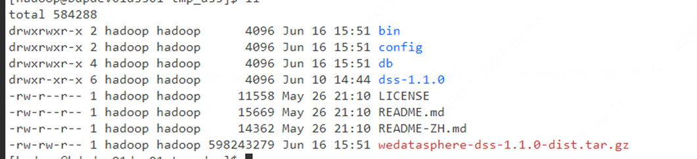

# DataSphere Studio 1.0.1 升级到 1.1.0 使用文档（同样适用于1.0.1到1.1.1）

### 升级步骤主要分为：
- 服务停止
- 执行数据库升级脚本
- dss部署目录替换为新版本包
- 配置文件添加，修改
- 服务启动

#### 1. 服务停止
进入到dss的部署目录，在目录下执行命令停止dss的所有服务：
```shell
cd ${DSS_DEPLOY_PATH}

sh sbin/dss-stop-all.sh
```
#### 2. 执行数据库升级sql脚本

升级sql脚本获取方式：

- dss1.1.0的安装包解压后的目录：db/version_update/from_v101_to_v110.sql
- 从github页面下载，地址为：（待上传补充）

然后登陆dss数据库执行source命令：

```shell
source ${your_path}/from_v101_to_v110.sql
```
正常情况下可以执行成功。

#### 3. dss部署目录替换为新版本包

**(重要：最好先备份好dss旧版本的数据库)**

- 通过mysqldump命令备份如下有结构变化的表：

dss_appconn、dss_appconn_instance、dss_workflow_node、dss_onestop_user_favorites、dss_component_role、dss_onestop_menu_application


这些表只是修改了表名，也可以备份下：

dss_dictionary
dss_role 
dss_admin_dept
dss_download_audit 
dss_flow_relation
dss_flow_edit_lock 
dss_onestop_menu 
dss_menu_role

- 备份dss旧版本的部署目录，以该目录为例：/appcom/Install/DSSInstall
```shell
mv /appcom/Install/DSSInstall /appcom/Install/DSSInstall-bak
```

将dss1.1.0的安装包放到临时目录解压：
```shell
mkdir /tmp/dss-pkg
mv wedatasphere-dss-1.1.0-dist.tar.gz /tmp/dss-pkg/
cd /tmp/dss-pkg
tar zxvf wedatasphere-dss-1.1.0-dist.tar.gz
```
解压后目录结构如下：


然后将dss-1.1.0目录下的文件全部拷贝到dss1.1.0的安装目录：
```shell
cd dss-1.1.0
cp -r lib dss-appconns sbin /appcom/Install/DSSInstall/
```

拷贝先前版本的配置文件：
```shell
cp -r /appcom/Install/DSSInstall-bak/conf /appcom/Install/DSSInstall/
```

#### 4. 添加、修改配置

新版本新增配置： dss-scriptis-server.properties、dss-guide-server.properties，
直接从dss1.1.0/conf目录拷贝：

```shell
cp -r conf/dss-scriptis-server.properties /appcom/Install/DSSInstall/conf/
cp -r conf/dss-guide-server.properties /appcom/Install/DSSInstall/conf/
```

配置修改：

1.在配置文件dss-framework-project-server.properties中加入：
```properties
###若appconn没有实现所有开发规范（节点更新、删除、拷贝、导入、导出操作），需要加入到该配置忽略检查
wds.dss.appconn.checker.development.ignore.list=workflow,sendemail
###若appconn没有实现所有工程规范（增删改查），需要加入到该配置忽略检查
wds.dss.appconn.checker.project.ignore.list=
```

并替换为新版本的restful、mybatis配置：
```properties
##restful
wds.linkis.server.restful.scan.packages=com.webank.wedatasphere.dss.framework.workspace.restful,com.webank.wedatasphere.dss.framework.project.restful,com.webank.wedatasphere.dss.framework.release.restful,com.webank.wedatasphere.dss.framework.appconn.restful,com.webank.wedatasphere.dss.framework.admin.restful
##mybatis
wds.linkis.server.mybatis.mapperLocations=classpath*:com/webank/wedatasphere/dss/framework/workspace/dao/impl/*.xml,classpath*:com/webank/wedatasphere/dss/application/dao/impl/*.xml,classpath*:com/webank/wedatasphere/dss/framework/project/dao/impl/*Mapper.xml,classpath*:com/webank/wedatasphere/dss/framework/appconn/dao/impl/*.xml,classpath*:com/webank/wedatasphere/dss/framework/release/dao/impl/*.xml,classpath*:com/webank/wedatasphere/dss/framework/admin/xml/impl/*.xml
wds.linkis.server.mybatis.typeAliasesPackage=com.webank.wedatasphere.dss.application.entity,com.webank.wedatasphere.dss.common.entity,com.webank.wedatasphere.dss.framework.workspace.bean,com.webank.wedatasphere.dss.framework.project.entity,com.webank.wedatasphere.dss.framework.appconn.entity,com.webank.wedatasphere.dss.framework.release.entity,com.webank.wedatasphere.dss.framework.admin.pojo.entity
wds.linkis.server.mybatis.BasePackage=com.webank.wedatasphere.dss.framework.workspace.dao,com.webank.wedatasphere.dss.application.dao,com.webank.wedatasphere.dss.framework.project.dao,com.webank.wedatasphere.dss.framework.appconn.dao,com.webank.wedatasphere.dss.framework.release.dao,com.webank.wedatasphere.dss.framework.admin.xml
```

#### 5. 服务启动
OK，到现在可以启动dss新版本的服务了，在**dss部署目录下**执行命令启动所有服务：

```shell
sh sbin/dss-start-all.sh 
```


