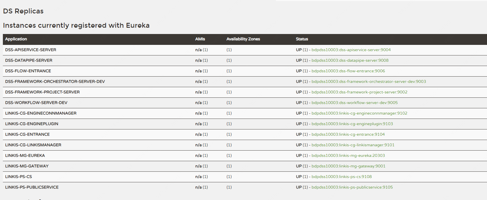

# DataSphere Studio一键安装使用文档

## 一、使用前环境准备

### a. 基础软件安装

Linkix需要的命令工具（在正式安装前，脚本会自动检测这些命令是否可用，如果不存在会尝试自动安装，安装失败则需用户手动安装以下基础shell命令工具）：

-   telnet
-   tar
-   sed
-   dos2unix
-   mysql
-   yum
-   java
-   unzip
-   zip
-   expect

需要安装的软件：

-   MySQL (5.5+)
    
-   JDK (1.8.0_141以上)
    
-   Python(2.x和3.x都支持)
    
-   Nginx
    

下面的服务必须可从本机访问：

-   Hadoop(**2.7.2，Hadoop 其他版本需自行编译 Linkis**) ，安装的机器必须支持执行 ``` hdfs dfs -ls / ``` 命令
    
-   Hive(**2.3.3，Hive 其他版本需自行编译 Linkis**)，安装的机器必须支持执行``` hive -e "show databases" ```命令
    
-   Spark(**支持2.0以上所有版本**) ，安装的机器必须支持执行```spark-sql -e "show databases" ```命令
    

Tips:

如您是第一次安装 Hadoop，单机部署 Hadoop 可参考：[Hadoop单机部署](https://hadoop.apache.org/docs/r2.7.2/hadoop-project-dist/hadoop-common/SingleCluster.html) ；分布式部署Hadoop可参考：[Hadoop分布式部署](https://hadoop.apache.org/docs/r2.7.2/hadoop-project-dist/hadoop-common/ClusterSetup.html)。

如您是第一次安装 Hive，可参考：[Hive快速安装部署](https://cwiki.apache.org/confluence/display/Hive/GettingStarted)。

如您是第一次安装 Spark，On Yarn 模式可参考：[Spark on Yarn部署](http://spark.apache.org/docs/2.4.3/running-on-yarn.html)。

### b. 创建用户

&nbsp;&nbsp;&nbsp;&nbsp;&nbsp;&nbsp;&nbsp;&nbsp;例如: **部署用户是 hadoop 账号**（可以不是 hadoop 用户，但是推荐使用Hadoop的超级用户进行部署，这里只是一个示例）

2.  在所有需要部署的机器上创建部署用户，用于安装

```shell script
 sudo useradd hadoop
```

3.  因为 Linkis 的服务是以 `sudo -u ${linux-user}` 方式来切换引擎，从而执行作业，所以部署用户需要有 sudo 权限，而且是免密的。

```shell script
 vi /etc/sudoers
```

```properties
    hadoop  ALL=(ALL)       NOPASSWD: NOPASSWD: ALL
```

4.  确保部署 DSS 和 Linkis 的服务器可正常执行 `hdfs dfs -ls` 、`hive -e` 和 `spark-sql -e` 等命令。在一键安装脚本中，会对组件进行检查。
    
5.  **如果您的 Pyspark 想拥有画图功能，则还需在所有安装节点，安装画图模块**。命令如下：

```shell script
python -m pip install matplotlib
```

### c.安装准备

自行编译或者去 release 页面下载安装包：  [wedatasphere-dss-x.x.x-dist.tar.gz](https://github.com/WeBankFinTech/DataSphereStudio/releases)

**请注意：为了能正常使用 Visualis1.0.0-RC1 和 Exchangis1.0.0-RC1，请去 releases 页面下载最新的一键安装部署包。**

**请注意：为了能正常使用 Visualis1.0.0-RC1 和 Exchangis1.0.0-RC1，请去 releases 页面下载最新的一键安装部署包。**

**如果您选择自行编译 Linkis，请确保编译的是 Linkis1.1.1。**

**如果您选择自行编译 DSS，请确保已 pull 了 DSS `master` 分支的最新代码。**

DSS & LINKIS 一键安装部署包的层级目录结构如下：

```text
├── dss_linkis # 一键部署主目录
 ├── bin # 用于一键安装，以及一键启动 DSS + Linkis
 ├── conf # 一键部署的参数配置目录
 ├── wedatasphere-dss-x.x.x-dist.tar.gz # DSS后台安装包
 ├── wedatasphere-dss-web-x.x.x-dist.zip # DSS前端安装包
 ├── wedatasphere-linkis-x.x.x-dist.tar.gz # Linkis安装包
```

如果您选择自行编译 Linkis 或 DSS，直接将上面的 Linkis 安装包或 DSS 安装包替换成编译后相关安装包即可。

### d. 修改配置

&nbsp;&nbsp;&nbsp;&nbsp;&nbsp;&nbsp;&nbsp;&nbsp;打开 `conf/config.sh`，按需修改相关配置参数：

```shell script
 vi conf/config.sh   
```

参数说明如下：

```properties
#################### 一键安装部署的基本配置 ####################

# 部署用户，默认为当前登录用户，非必须不建议修改
# deployUser=hadoop

# 非必须不建议修改
LINKIS_VERSION=1.1.1

### DSS Web，本机安装一般无需修改，但需确认此端口是否占用，若被占用，修改一个可用端口即可。
#DSS_NGINX_IP=127.0.0.1
#DSS_WEB_PORT=8088

# 非必须不建议修改
DSS_VERSION=1.0.1

## Java应用的堆栈大小。如果部署机器的内存少于8G，推荐128M；达到16G时，推荐至少256M；如果想拥有非常良好的用户使用体验，推荐部署机器的内存至少达到32G。
export SERVER_HEAP_SIZE="128M"

############################################################
##################### Linkis 的配置开始 #####################
########### 非注释的参数必须配置，注释掉的参数可按需修改 ##########
############################################################

### DSS工作空间目录
WORKSPACE_USER_ROOT_PATH=file:///tmp/linkis/
### 用户 HDFS 根路径
HDFS_USER_ROOT_PATH=hdfs:///tmp/linkis
### 结果集路径: file 或者 hdfs path
RESULT_SET_ROOT_PATH=hdfs:///tmp/linkis

### Path to store started engines and engine logs, must be local
ENGINECONN_ROOT_PATH=/appcom/tmp

#ENTRANCE_CONFIG_LOG_PATH=hdfs:///tmp/linkis/

### HADOOP配置文件路径，必须配置
HADOOP_CONF_DIR=/appcom/config/hadoop-config
### HIVE CONF DIR
HIVE_CONF_DIR=/appcom/config/hive-config
### SPARK CONF DIR
SPARK_CONF_DIR=/appcom/config/spark-config

# for install
#LINKIS_PUBLIC_MODULE=lib/linkis-commons/public-module


## YARN REST URL，ensure this PORT have no conflict with DSS_WEB_PORT
YARN_RESTFUL_URL=http://127.0.0.1:8088

## Engine版本配置，不配置则采用默认配置
#SPARK_VERSION
#SPARK_VERSION=2.4.3
##HIVE_VERSION
#HIVE_VERSION=1.2.1
#PYTHON_VERSION=python2

## LDAP is for enterprise authorization, if you just want to have a try, ignore it.
#LDAP_URL=ldap://localhost:1389/
#LDAP_BASEDN=dc=webank,dc=com
#LDAP_USER_NAME_FORMAT=cn=%s@xxx.com,OU=xxx,DC=xxx,DC=com

# Microservices Service Registration Discovery Center
#LINKIS_EUREKA_INSTALL_IP=127.0.0.1         
#LINKIS_EUREKA_PORT=20303
#LINKIS_EUREKA_PREFER_IP=true

###  Gateway install information
#LINKIS_GATEWAY_PORT =127.0.0.1
#LINKIS_GATEWAY_PORT=9001

### ApplicationManager
#LINKIS_MANAGER_INSTALL_IP=127.0.0.1
#LINKIS_MANAGER_PORT=9101

### EngineManager
#LINKIS_ENGINECONNMANAGER_INSTALL_IP=127.0.0.1
#LINKIS_ENGINECONNMANAGER_PORT=9102

### EnginePluginServer
#LINKIS_ENGINECONN_PLUGIN_SERVER_INSTALL_IP=127.0.0.1
#LINKIS_ENGINECONN_PLUGIN_SERVER_PORT=9103

### LinkisEntrance
#LINKIS_ENTRANCE_INSTALL_IP=127.0.0.1
#LINKIS_ENTRANCE_PORT=9104

###  publicservice
#LINKIS_PUBLICSERVICE_INSTALL_IP=127.0.0.1
#LINKIS_PUBLICSERVICE_PORT=9105

### cs
#LINKIS_CS_INSTALL_IP=127.0.0.1
#LINKIS_CS_PORT=9108

##################### Linkis 的配置完毕 #####################

############################################################
####################### DSS 的配置开始 #######################
########### 非注释的参数必须配置，注释掉的参数可按需修改 ##########
############################################################

# 用于存储发布到 Schedulis 的临时ZIP包文件
WDS_SCHEDULER_PATH=file:///appcom/tmp/wds/scheduler

### This service is used to provide dss-framework-project-server capability.
#DSS_FRAMEWORK_PROJECT_SERVER_INSTALL_IP=127.0.0.1
#DSS_FRAMEWORK_PROJECT_SERVER_PORT=9002

### This service is used to provide dss-framework-orchestrator-server capability.
#DSS_FRAMEWORK_ORCHESTRATOR_SERVER_INSTALL_IP=127.0.0.1
#DSS_FRAMEWORK_ORCHESTRATOR_SERVER_PORT=9003

### This service is used to provide dss-apiservice-server capability.
#DSS_APISERVICE_SERVER_INSTALL_IP=127.0.0.1
#DSS_APISERVICE_SERVER_PORT=9004

### This service is used to provide dss-workflow-server capability.
#DSS_WORKFLOW_SERVER_INSTALL_IP=127.0.0.1
#DSS_WORKFLOW_SERVER_PORT=9005

### dss-flow-Execution-Entrance
### This service is used to provide flow execution capability.
#DSS_FLOW_EXECUTION_SERVER_INSTALL_IP=127.0.0.1
#DSS_FLOW_EXECUTION_SERVER_PORT=9006

### This service is used to provide dss-datapipe-server capability.
#DSS_DATAPIPE_SERVER_INSTALL_IP=127.0.0.1
#DSS_DATAPIPE_SERVER_PORT=9008

##sendemail配置，只影响DSS工作流中发邮件功能
EMAIL_HOST=smtp.163.com
EMAIL_PORT=25
EMAIL_USERNAME=xxx@163.com
EMAIL_PASSWORD=xxxxx
EMAIL_PROTOCOL=smtp 
####################### DSS 的配置结束 #######################
```

### f. 修改数据库配置

请确保配置的数据库，安装机器可以正常访问，否则将会出现DDL和DML导入失败的错误。

```shell script
 vi conf/db.sh 
```

```properties
### 配置DSS数据库
MYSQL_HOST=127.0.0.1
MYSQL_PORT=3306
MYSQL_DB=dss
MYSQL_USER=xxx
MYSQL_PASSWORD=xxx

## Hive metastore的数据库配置，用于Linkis访问Hive的元数据信息
HIVE_HOST=127.0.0.1
HIVE_PORT=3306
HIVE_DB=xxx
HIVE_USER=xxx
HIVE_PASSWORD=xxx
```

## 二、安装和使用

### 1. 执行安装脚本：

```shell script
 sh bin/install.sh
```

### 2. 安装步骤

-   该安装脚本会检查各项集成环境命令，如果没有请按照提示进行安装，以下命令为必须项：
    
    _yum java mysql unzip expect telnet tar sed dos2unix nginx_
    
-   安装时，脚本会询问您是否需要初始化数据库并导入元数据，Linkis 和 DSS 均会询问。
    

&nbsp;&nbsp;&nbsp;&nbsp;&nbsp;**第一次安装**必须选是。

### 3. 是否安装成功：

&nbsp;&nbsp;&nbsp;&nbsp;&nbsp;通过查看控制台打印的日志信息查看是否安装成功。

&nbsp;&nbsp;&nbsp;&nbsp;&nbsp;如果有错误信息，可以查看具体报错原因。

### 4. 启动服务

如果您本机已有 DSS 和 Linkis 的服务正在运行中，请先停掉所有相关服务。

#### (1) 启动服务：

&nbsp;&nbsp;&nbsp;&nbsp;&nbsp;在安装目录执行以下命令，启动所有服务：

```shell
sh bin/start-all.sh
```

&nbsp;&nbsp;&nbsp;&nbsp;&nbsp;如果启动产生了错误信息，可以查看具体报错原因。启动后，各项微服务都会进行**通信检测**，如果有异常则可以帮助用户定位异常日志和原因。

#### (2) 查看是否启动成功

&nbsp;&nbsp;&nbsp;&nbsp;&nbsp;可以在Eureka界面查看 Linkis & DSS 后台各微服务的启动情况。


#### (3) 谷歌浏览器访问：

请使用**谷歌浏览器**访问以下前端地址：

`http://DSS_NGINX_IP:DSS_WEB_PORT` **启动日志会打印此访问地址**。登陆时管理员的用户名和密码均为部署用户名，如部署用户为hadoop，则管理员的用户名为：hadoop（密码：dss<1.0.1版本和部署用户一致；dss>=1.0.1 版本,密码是在执行部署是随机生成一个密码串，存储于{LinkisInstallPath}/conf/linkis-mg-gateway.properties)

#### (4) 停止服务：

&nbsp;&nbsp;&nbsp;&nbsp;&nbsp;在安装目录执行以下命令，停止所有服务：

```shell script
 sh bin/stop-all.sh
```
