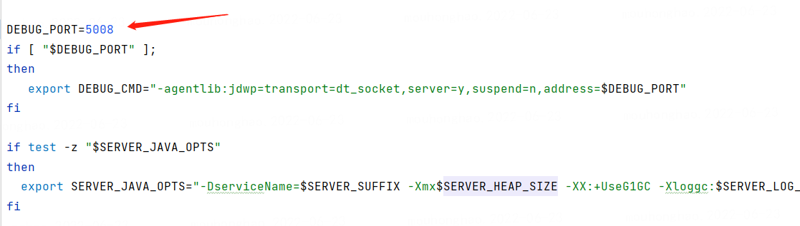
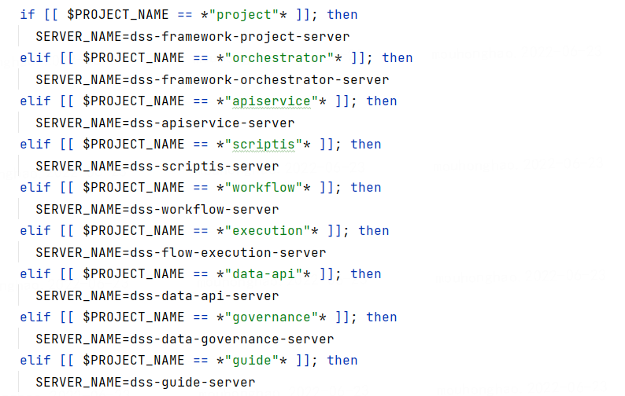
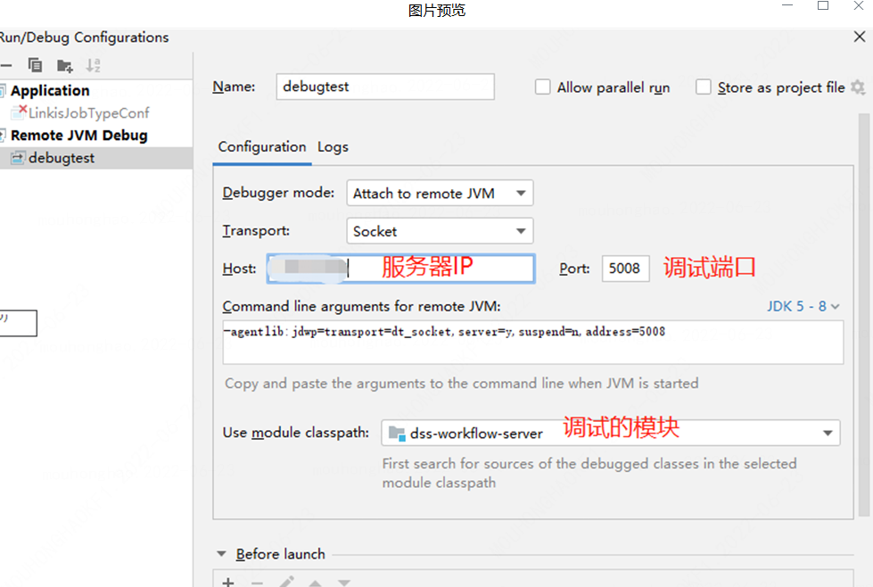
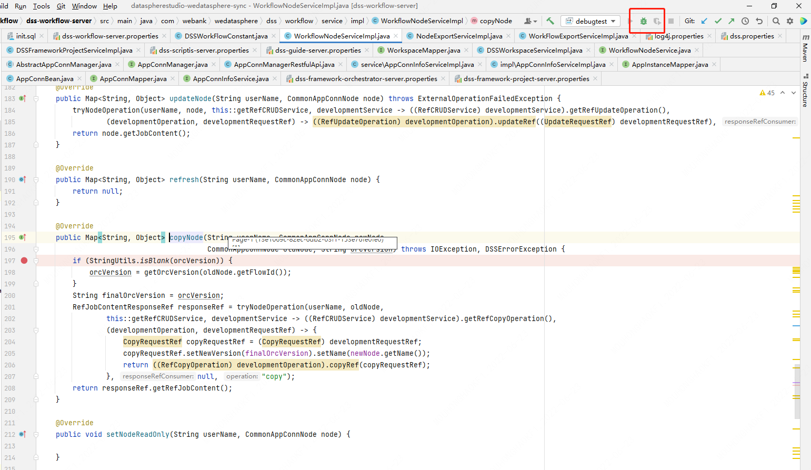
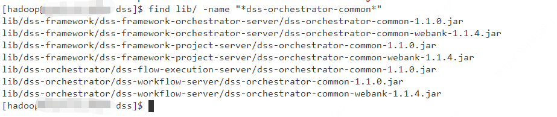

# 调试相关

> 没有任何程序员能够一气呵成的写出没有任何Bug的代码，所以很多程序员有相当一部分时间是花费在Debug上的，程序调试是每个程序员必须面对的工作，下面就指导大家如何进行dss远程调试(基于DSS1.1.0版本)。

## step 1 准备DSS源码并编译

```plain
git clone https://github.com/WeBankFinTech/DataSphereStudio.git
cd DataSphereStudio
#如果需要 可以切换到对应的分支上
#git checkout dev-xxx
mvn -N install 
mvn clean Install
```

## step 2 在服务器上部署好DSS服务
若尚未部署DSS可参考部署文档：[DSS单机部署文档](./DSS单机部署文档.md)

## step 3 打开调试端口

首先需要明确需要调试的包所在的服务，根据需要调试的代码位置,确定其所属的服务。

进入dss部署目录下的该目录：${DSS_HOME}/sbin/ext，修改需要调试的对应服务的启动脚本文件，开启远程调用端口：（以workflow-server服务为例）

```properties
cd ${DSS_HOME}

vim sbin/ext/dss-workflow-server
```
在脚本中找到 DEBUG_PORT 关键字，然后输入需要打开的端口号（要从本地能够连通）：



接着需要重启对应服务使之生效：

```
sh sbin/dss-daemon.sh restart workflow-server
```
注：如果不确定服务名称，可以在 ${DSS_HOME}/sbin/common.sh 脚本内查询，
只需要输入服务的关键字即可启动对应服务：




## step 4 IDEA编译器配置远程调试
如下图所示打开窗口并配置远程调试的端口,服务,以及模块：  



## step 5. 开始调试

在idea右上角点击调试按钮，即可可以开始调试：



## step 6. 替换jar包

本地修改了代码后，可以打包好对应模块的jar包，然后替换服务器上对应lib的jar。重启服务即可。

```properties
cd ${DSS_HOME}

## 往服务器上传jar包
rz -bye

##将上传的jar包拷贝替换原来jar包
cp ${your_jar_name} lib/${jar_path}
```

注：若不清楚该jar在哪些服务的lib中存在，可通过如下命令搜索该jar的所有位置：
```properties
cd ${DSS_HOME}
###搜索lib目录下的所有dss-orchestrator-common-*.jar包
find lib/ -name "*dss-orchestrator-common*"
```

