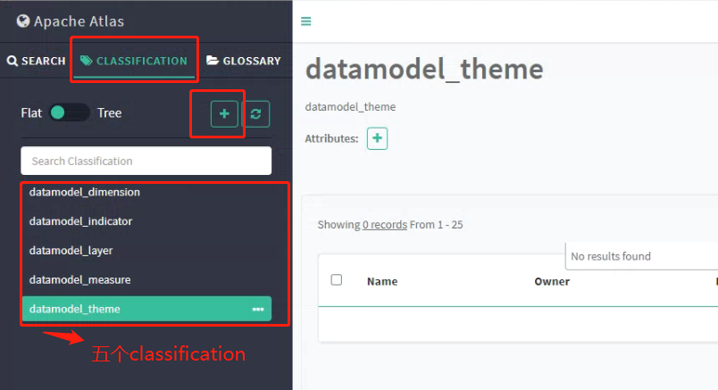
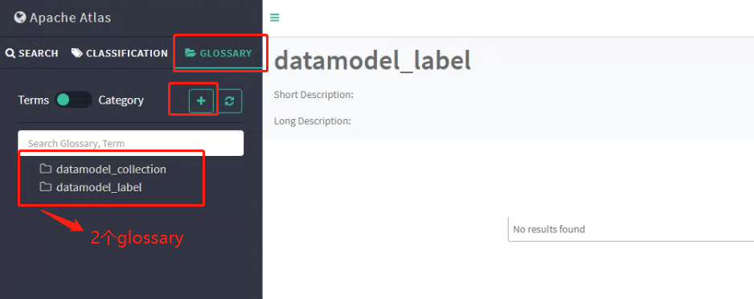

# 数据管理 配置文档

## 1. 准备工作

### 1.1 安装Atlas
您在部署 `数据管理` 之前，需要依赖`Atlas`

**请注意：目前 `Atlas` 版本只验证了2.X**

关于 `Atlas` 的安装部署，请参考：`Atlas` [安装部署文档](https://atlas.apache.org/#/Installation)
### 1.2 编译Linkis的Hive引擎代码
由于`数据管理`的`dss-dataasset-management`服务依赖`Atlas` ，需要在Hive引擎中添加Atlas hook相关的 pom进行编译
```shell script
  <properties>
        <hive.version>2.3.3</hive.version>
        <datanucleus-api-jdo.version>4.2.4</datanucleus-api-jdo.version>
        <datanucleus-rdbms.version>4.1.19</datanucleus-rdbms.version>
        <atlas.version>2.0.0</atlas.version>
        <datanucleus-javax.jdo.version>3.2.0-m3</datanucleus-javax.jdo.version>
    </properties>
 <dependency>
            <groupId>org.datanucleus</groupId>
            <artifactId>datanucleus-api-jdo</artifactId>
            <version>${datanucleus-api-jdo.version}</version>
        </dependency>
        <dependency>
            <groupId>org.datanucleus</groupId>
            <artifactId>datanucleus-rdbms</artifactId>
            <version>${datanucleus-rdbms.version}</version>
        </dependency>
        <dependency>
            <groupId>org.datanucleus</groupId>
            <artifactId>javax.jdo</artifactId>
            <version>${datanucleus-javax.jdo.version}</version>
        </dependency>
        <dependency>
            <groupId>org.apache.atlas</groupId>
            <artifactId>hive-bridge</artifactId>
            <version>${atlas.version}</version>
            <exclusions>
                <exclusion>
                    <groupId>org.springframework</groupId>
                    <artifactId>*</artifactId>
                </exclusion>
                <exclusion>
                    <groupId>org.apache.hadoop</groupId>
                    <artifactId>*</artifactId>
                </exclusion>
            </exclusions>
        </dependency>
        <dependency>
            <groupId>org.apache.atlas</groupId>
            <artifactId>atlas-plugin-classloader</artifactId>
            <version>${atlas.version}</version>
            <exclusions>
                <exclusion>
                    <groupId>org.springframework</groupId>
                    <artifactId>*</artifactId>
                </exclusion>
                <exclusion>
                    <groupId>org.apache.hadoop</groupId>
                    <artifactId>*</artifactId>
                </exclusion>
            </exclusions>
        </dependency>
        <dependency>
            <groupId>org.apache.atlas</groupId>
            <artifactId>hive-bridge-shim</artifactId>
            <version>${atlas.version}</version>
            <exclusions>
                <exclusion>
                    <groupId>org.springframework</groupId>
                    <artifactId>*</artifactId>
                </exclusion>
                <exclusion>
                    <groupId>org.apache.hadoop</groupId>
                    <artifactId>*</artifactId>
                </exclusion>
            </exclusions>
        </dependency>
```
如果您是第一次安装Linkis,直接整体编译，然后通过一键安装包正常安装即可；如果是单独安装的话，就只需要编译此模块，然后使用target下out/hive目录替换掉服务器中的 linkis/lib/linkis-engineconn-plugins/hive目录即可。
### 1.3 Hive配置
#### hive-site.xml中添加下面配置
```shell script
<property>
    <name>hive.exec.post.hooks</name>
    <value>org.apache.atlas.hive.hook.HiveHook</value>
</property>
```
#### 在hive的conf目录添加atlas的properties文件
```shell script
### 有两种方式，1软连接的方式，2.直接把atlas的atlas-application.properties文件拷贝到hive的conf目录
1.软连接
ln -s /home/hadoop/software/apache-atlas-2.0.0/conf/atlas-application.properties /home/hadoop/software/hive-2.3.3/conf
2. 拷贝
cp /home/hadoop/software/apache-atlas-2.0.0/conf/atlas-application.properties /home/hadoop/software/hive-2.3.3/conf
```
## 2. 数据管理模块介绍

`数据管理` 分为三个模块，`dss-dataasset-management`、`dss-datamodel-center`和`dss-datawarehouse-design`,其中`dss-dataasset-management`为数据资产管理，对整个数仓的一个数据概览，包括血缘分析、表搜索等`dss-datamodel-center`为数据模型中心，主要定义表的物理模型和业务模型;`dss-datawarehouse-design`为数仓设计管理，主要涉及到数仓的分层管理，维度定义、指标定义等。模块代码如下

## 3. 数据管理模块配置
这三个模块的安装都加入到自动化脚本安装当中，其中数据库脚本的初始化在安装dss的时候就可以完成，如果单独安装，可在对应模块的代码中初始化数据库脚本；一键启动脚本(dss-start-all.sh)和一键停止脚本(dss-stop-all.sh)也会对这三个服务起作用；接下来需要根据您的环境配置对应的配置文件。
### 3.1 配置dss-dataasset-management模块
   #### 配置文件修改：
```shell script
  vi  /home/hadoop/software/dss_linkis/dss/conf/dss-data-assets-server.properties
spring.server.port=9300
spring.spring.application.name=dss-data-assets-server
wds.linkis.test.mode=false
wds.linkis.log.clear=true
wds.linkis.server.version=v1
##以下需要配置hive的元数据库信息
wds.linkis.server.mybatis.datasource.url=jdbc:mysql://localhost:3306/hive?useSSL=false&characterEncoding=UTF-8
wds.linkis.server.mybatis.datasource.username=root
wds.linkis.server.mybatis.datasource.password=root
wds.linkis.server.restful.scan.packages=com.webank.wedatasphere.dss.data.governance.restful
##mybatis
wds.linkis.server.mybatis.mapperLocations=classpath*:com/webank/wedatasphere/dss/data/governance/dao/impl/*.xml
wds.linkis.server.mybatis.typeAliasesPackage=com.webank.wedatasphere.dss.data.governance.entity
wds.linkis.server.mybatis.BasePackage=com.webank.wedatasphere.dss.data.governance.dao
# atlas config
##以下需要配置Atlas的Web信息，Atlas默认用户名密码为admin/admin
atlas.rest.address=http://localhost:21000
atlas.username=admin
atlas.password=admin
atlas.client.readTimeoutMSecs=60000
atlas.client.connectTimeoutMSecs=60000
# create root classification
##以下是在Atlas中配置的classification和glossary信息，后面会介绍到，你按照这个填写就OK了
atlas.root.indicator=datamodel_indicator
atlas.root.measure=datamodel_measure
atlas.root.dimension=datamodel_dimension
atlas.root.layer=datamodel_layer
atlas.root.theme=datamodel_theme
# create root glossary
atlas.root.label=datamodel_label
atlas.root.collection=datamodel_collection
# hive metadata config
##以下需要配置dss的数据库信息
metastore.datasource.driver=com.mysql.jdbc.Driver
metastore.datasource.url=jdbc:mysql://localhost:3306/dss?characterEncoding=UTF-8
metastore.datasource.username=root
metastore.datasource.password=root
##以下需要配置Linkis的Gateway信息
wds.workspace.client.serverurl=http://localhost:9001
##以下需要配置Linkis的认证信息
wds.workspace.client.authtoken.key=hadoop
wds.workspace.client.authenticationStrategy=org.apache.linkis.httpclient.dws.authentication.TokenAuthenticationStrategy
wds.workspace.client.discovery.enabled=false
wds.workspace.client.authtoken.value=BML-AUTH
spring.spring.mvc.servlet.path=/api/rest_j/v1
wds.workspace.client.dws.version=v1
wds.wedatasphere.data.assert.client.strategy=static
```
   #### Atlas中添加classification和glossary：

在atlas添加classification信息，如下图所示：



在atlas添加glossary信息，如下图所示：


### 3.2 配置dss-datamodel-center模块
```shell script
vi  /home/hadoop/software/dss_linkis/dss/conf/dss-datamodel-center-server.properties
spring.server.port=9400
spring.spring.application.name=dss-datamodel-center-server
wds.linkis.test.mode=false
##以下需要配置Dss的数据库信息
wds.linkis.server.mybatis.datasource.url=jdbc:mysql://localhost:3306/dss?useSSL=false&characterEncoding=UTF-8
wds.linkis.server.mybatis.datasource.username=root
wds.linkis.server.mybatis.datasource.password=root
wds.linkis.log.clear=true
wds.linkis.server.version=v1
##以下需要配置Linkis的认证信息
wds.wedatasphere.linkis.serverurl=http://localhost:9001
wds.wedatasphere.linkis.authtoken.key=hadoop
wds.wedatasphere.linkis.discovery.enabled=false
wds.wedatasphere.linkis.authenticationStrategy=org.apache.linkis.httpclient.dws.authentication.TokenAuthenticationStrategy
wds.wedatasphere.linkis.authtoken.value=BML-AUTH
wds.wedatasphere.linkis.dws.version=v1
##restful
wds.linkis.server.restful.scan.packages=com.webank.wedatasphere.dss.datamodel.indicator.restful,\
  com.webank.wedatasphere.dss.datamodel.table.restful,\
  com.webank.wedatasphere.dss.datamodel.dimension.restful,\
  com.webank.wedatasphere.dss.datamodel.measure.restful
wds.linkis.server.mybatis.mapperLocations=classpath*:com/webank/wedatasphere/dss/datamodel/dimension/dao/impl/*.xml,\
  classpath*:com/webank/wedatasphere/dss/datamodel/table/dao/impl/*.xml,\
  classpath*:com/webank/wedatasphere/dss/datamodel/measure/dao/impl/*.xml,\
  classpath*:com/webank/wedatasphere/dss/datamodel/indicator/dao/impl/*.xml
wds.linkis.server.mybatis.BasePackage=com.webank.wedatasphere.dss.datamodel.dimension.dao,\
  com.webank.wedatasphere.dss.datamodel.table.dao,\
  com.webank.wedatasphere.dss.datamodel.measure.dao,\
  com.webank.wedatasphere.dss.datamodel.indicator.dao
##服务需要访问dss-dataasset-management服务，以下需要配置assets服务的认证信息
wds.wedatasphere.warehouse.client.serverurl=http://localhost:9001
wds.wedatasphere.warehouse.client.authtoken.key=hadoop
wds.wedatasphere.warehouse.client.authenticationStrategy=org.apache.linkis.httpclient.dws.authentication.TokenAuthenticationStrategy
wds.wedatasphere.warehouse.client.authtoken.value=BML-AUTH
wds.wedatasphere.warehouse.client.discovery.enabled=false
wds.wedatasphere.warehouse.client.dws.version=v1
##服务需要访问dss-datawarehouse-design服务，以下需要配置datawarehouse服务的认证信息
wds.wedatasphere.assets.client.serverurl=http://localhost:9001
wds.wedatasphere.assets.client.authtoken.key=hadoop
wds.wedatasphere.assets.client.authenticationStrategy=org.apache.linkis.httpclient.dws.authentication.TokenAuthenticationStrategy
wds.wedatasphere.assets.client.discovery.enabled=false
wds.wedatasphere.assets.client.authtoken.value=BML-AUTH
wds.wedatasphere.assets.client.dws.version=v1
wds.workspace.client.serverurl=http://localhost:9001
```
### 3.3 配置dss-datawarehouse-design模块
```shell script
vi  /home/hadoop/software/dss_linkis/dss/conf/dss-data-warehouse-server.properties
spring.server.port=9500
spring.spring.application.name=dss-data-warehouse-server
wds.linkis.test.mode=false
##以下需要配置Dss的数据库信息
wds.linkis.server.mybatis.datasource.url=jdbc:mysql://localhost:3306/dss?useSSL=false&characterEncoding=UTF-8
wds.linkis.server.mybatis.datasource.username=root
wds.linkis.server.mybatis.datasource.password=root
wds.linkis.log.clear=true
wds.linkis.server.version=v1
## datasource client
##以下需要配置datawarehouse datasource服务的认证信息
wds.datawarehouse.datasource.client.serverurl=http://hadoop:9001
wds.datawarehouse.datasource.client.authtoken.key=hadoop
wds.datawarehouse.datasource.client.authtoken.value=BML-AUTH
wds.datawarehouse.datasource.client.dws.version=v1
##restful
wds.linkis.server.restful.scan.packages=com.webank.wedatasphere.warehouse.restful
wds.linkis.server.mybatis.mapperLocations=classpath*:com/webank/wedatasphere/warehouse/dao/mapper/impl/*.xml
wds.linkis.server.mybatis.BasePackage=com.webank.wedatasphere.warehouse.dao.mapper
wds.entity.workspace.name.auto.transform=false
spring.spring.mvc.servlet.path=/api/rest_j/v1
```
## 4. 重启服务
### 4.1 重启服务
sh bin/start-all.sh
