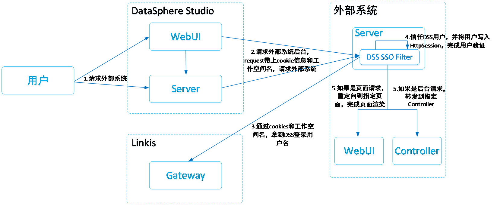
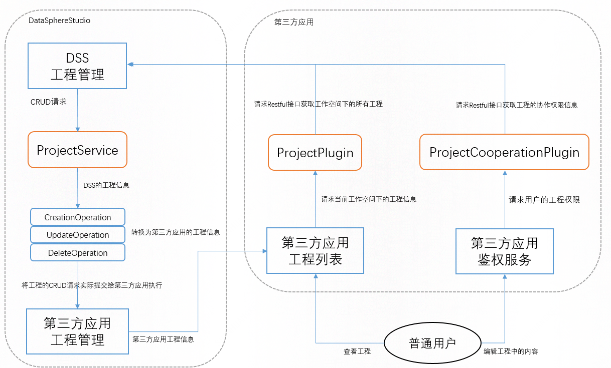

# AppConn 开发指南

## 一、前言

第三方系统通过实现一个 ```AppConn``` 来接入 DSS，DSS 提供了多种 ```AppConn``` 用于方便不同应用场景的第三方系统的快速接入。

以下是各种基础 ```AppConn``` 的详细介绍，每一种 AppConn 都代表了 DSS 框架抽象的一种能力：

- ```OnlySSOAppConn```。如果您的第三方系统想与 DSS 完成 SSO 免登录跳转，则需使用该 AppConn 提供的能力。
- ```OnlyStructureAppConn```。如果您的第三方系统想与 DSS 统一组织结构，如：工程的统一创建、更新、删除等管理操作，角色权限管理的统一管理，则需继承该 AppConn。
- ```OnlyDevelopmentAppConn```。如果您的第三方系统想作为 DSS 工作流的一个节点集成进来，则需实现该 AppConn。
- ```OptionalAppConn```。该 AppConn 是 一个可选的非强制实现的 AppConn 规范。用于协助第三方 AppConn 提供一些特殊的 Operation 能力，这些 Operation 与 DSS 的框架逻辑无关，并不是 DSS 框架要求第三方 AppConn 需具备的能力。

在以上的基础 AppConn 之上，DSS为方便大家集成对接，提供了几个组合 AppConn，分别是：

- ```SchedulerAppConn```。该 AppConn 是 ```OnlySSOAppConn``` 和 ```OnlyStructureAppConn``` 的子类，用于将一条 DSS 工作流同步给第三方调度系统，补充 DSS 工作流的调度能力；如果您想对接其他调度系统，则需实现该 AppConn。
- ```SecondlyAppConn```。是 ```OnlySSOAppConn``` 和 ```OnlyStructureAppConn``` 的子类，表示第三方系统既想打通 SSO，又想打通组织结构。
- ```ThirdlyAppConn```。是 ```OnlySSOAppConn```、```OnlyStructureAppConn``` 和 ```OnlyDevelopmentAppConn``` 的子类，表示第三方系统既想打通 SSO 和组织结构，又想作为 DSS 工作流的一个节点集成进来。

您可以根据实际需要，选择对应的 ```AppConn``` 进行实现。

## 二、基础 AppConn 的详细介绍

```AppConn``` 的具体实现包含以下几个层面，第一层是 ```AppConn``` 层，第二层是 ```AppStandard``` 规范层，第三层是 ```Service``` 层，第四层是 ```Operation``` 层，主要的业务逻辑都是在 ```Operation``` 层实现的, 参数的传递统一采用的是 ```Ref``` 实现类。

以树形结构表达其组织结构关系如下：

```html
|-- [OnlySSOAppConn](#21-onlyssoappconn--打通-sso-免登录跳转)：第三方系统与 DSS 完成 SSO 免登录跳转，已提供默认实现，用户无需该 AppConn 的任何方法。
|   |-- SSOIntegrationStandard：DSS 与 第三方系统的 SSO 免登录跳转规范，已提供默认实现，用户无需该 AppConn 的任何方法。
|   |   |-- SSORequestService：提供通用的、可以向与 DSS 集成的第三方 AppConn 系统发送前端或后台请求的服务能力。
|   |   |   |-- SSORequestOperation：向与 DSS 集成的第三方 AppConn 系统发送前端或后台请求。
|   |   |-- SSOPluginService：与 `SSOBuilderService` 对应，第三方系统在引入 DSS SSO Jar 后，该Jar 会使用该 Service 解析第三方系统的后台 `HttpServletRequest`，获取所需的 DSS 实体信息。
|   |   |   |-- SSOMsgParseOperation：**_无需关注，如感兴趣，可参阅架构设计文档_**。
|   |   |   |-- DssMsgCacheOperation：：**_无需关注，如感兴趣，可参阅架构设计文档_**。
|   |   |   |-- WorkspaceInfoOperation：：**_无需关注，如感兴趣，可参阅架构设计文档_**。
|   |   |-- [SSOUserService](#214-dss-与-第三方-appconn-的用户同步)：DSS 用户与第三方 AppConn 的用户同步服务。**_可按需实现_**。
|   |   |   |-- SSOUserCreationOperation：用于请求第三方 AppConn 创建同名用户。
|   |   |   |-- SSOUserUpdateOperation：用于修改第三方 AppConn 用户的基础信息。
|   |   |   |-- SSOUserGetOperation：用于请求第三方 AppConn 获取同名用户信息。
|   |   |   |-- SSOUserDeletionOperation：预留接口，用于删除第三方 AppConn 用户。
|   |   |-- SSOBuilderService：与 `SSOPluginService` 对应，向第三方系统发起 Http 请求时，用于拼出可支持 SSO 免密访问能力的第三方系统的特殊 URL。
|   |   |   |-- SSOUrlBuilderOperation：**_无需关注，如感兴趣，可参阅架构设计文档_**。
|   |   |   |-- DssMsgBuilderOperation：**_无需关注，如感兴趣，可参阅架构设计文档_**。
|-- [OnlyStructureAppConn](#22-onlystructureappconn--接入-dss-组织结构规范)：与 DSS 统一组织结构，如：工程的统一创建、更新、删除等管理操作。
|   |-- StructureIntegrationStandard：DSS 的二级规范，为组织结构规范，主要提供了工程管理服务能力、角色管理服务能力 和 第三方系统状态管理能力。
|   |   |-- ProjectService：用于打通 DSS 工程与接入的第三方系统的工程体系，实现工程的协同管理。
|   |   |   |-- ProjectCreationOperation：请求第三方系统创建一个与 DSS 工程一对一关联的第三方 refProject。
|   |   |   |-- ProjectUpdateOperation：请求第三方系统更新关联的第三方 refProject。
|   |   |   |-- ProjectDeletionOperation：请求第三方系统删除关联的第三方 refProject。
|   |   |   |-- ProjectSearchOperation：请求第三方系统查询包含了 projectName 的工程。
|   |   |-- RoleService：统一角色规范，用于打通DSS与各集成接入系统的角色体系。**_预留规范，暂无需实现_**。
|   |   |   |-- RoleCreationOperation：请求第三方系统创建一个与 DSS 角色一对一关联的第三方 refRole。
|   |   |   |-- RoleUpdateOperation：请求第三方系统更新与 DSS 角色已经一对一关联的第三方 refRole。
|   |   |   |-- RoleDeletionOperation：请求第三方系统删除关联的第三方 refRole。
|   |   |   |-- RoleUrlOperation：用于当用户在 DSS 前端设置第三方系统的这个角色的权限信息时，返回第三方系统该角色的前端跳转页面 jumpURL。
|   |   |-- AppStatusService：第三方应用状态检查规范。**_预留规范，暂无需实现_**。
|   |   |   |-- AppStatusOperation：检查第三方系统的状态，如果发现该第三方系统出现异常，以便及时告警或展示给到前端使用用户。
|-- [OnlyDevelopmentAppConn](#23-onlydevelopmentappconn--接入-dss-开发流程规范)：如果您的第三方系统想作为 DSS 工作流的一个节点集成进来，则需实现该 AppConn。
|   |-- DevelopmentIntegrationStandard：DSS 开发流程规范。可直接继承 `AbstractDevelopmentIntegrationStandard`，包含五个需要用户实现的 `DevelopmentService`。
|   |   |-- RefCRUDService：Job 管理规范，主要用于管理第三方应用工具的 Job（命名为 refJob）。
|   |   |   |-- RefCreationOperation，第三方应用工具的 Job（命名为 refJob）的创建操作。
|   |   |   |-- RefCopyOperation，第三方应用工具的 Job（命名为 refJob）的复制操作。
|   |   |   |-- RefUpdateOperation，第三方应用工具的 Job（命名为 refJob）的更新操作。
|   |   |   |-- RefDeletionOperation，第三方应用工具的 Job（命名为 refJob）的删除操作。
|   |   |-- RefExecutionService：Job 执行规范，主要用于执行第三方应用工具的 Job。
|   |   |   |-- RefExecutionOperation：执行第三方 AppConn 的 refJob。
|   |   |-- RefExportService：Job 导出规范，主要用于导出第三方应用工具的 Job。
|   |   |   |-- RefExportOperation：支持将第三方 AppConn 的 Job 导出成 Linkis BML 物料或 `InputStream` 字节流。
|   |   |-- RefImportService：Job 导入规范，主要用于导入第三方应用工具的 Job。
|   |   |   |-- RefImportOperation：通过传入 Linkis BML 物料或 `InputStream` 字节流，第三方 AppConn 需支持将其转换成一个 refJob。
|   |   |-- RefQueryService：Job 查询规范，主要用于打开第三方应用工具的 Job 的页面。
|   |   |   |-- RefQueryJumpUrlOperation：用于当用户在前端双击该工作流节点时，返回一个可以跳转的 jumpURL。
|   |   |   |-- RefQueryOperation：在 refProject 下获取第三方 AppConn 的 refJob 的一些信息。
|-- [OptionalAppConn](#24-optionalappconn--可选的非强制实现的-appconn-规范)：协助第三方 AppConn 提供一些特殊的 `Operation` 能力。
|   |-- OptionalIntegrationStandard：可选规范。
|   |   |-- OptionalService：为第三方 AppConn 提供的通用 `Service` 服务，用于构建一些具备特殊能力的 `Operation`，以供 DSS 内嵌的应用工具使用。
|   |   |   |-- OptionalOperation：第三方系统具备特殊能力的 `Operation`。
```

### 2.1 OnlySSOAppConn —— 打通 SSO 免登录跳转

如果您的第三方系统想与 DSS 完成 SSO 免登录跳转，则需使用该 AppConn 提供的能力。

`OnlySSOAppConn` 提供了默认的抽象类 `AbstractOnlySSOAppConn`，该抽象类已提供了一级规范的默认实现。

**_请注意：一般情况下，相关的 `AppConn` 子类会主动继承该抽象类，因此您无需实现 `OnlySSOAppConn` 的任何方法_**。

如果您的第三方系统只想与 DSS 实现 SSO 免登录跳转，那您甚至无需重新写一个 `OnlySSOAppConn` 实现，您只需直接使用 `SSOAppConn` 即可。

如何使用 `SSOAppConn`？只需在 DSS 的 dss_appconn 表中新增一条记录，将 reference 字段指定为 sso 即可。

关于 dss_appconn 表的介绍，请参考：[dss_appconn 表介绍](第三方系统接入DSS开发指南.md#331-dss_appconn-表)。

**_`OnlySSOAppConn` 的核心，是需要第三方应用工具按照要求引入 DSS 的 SSO Jar 包，完成相关接口的代码实现和引入，具体如下_**：

DSS 提供了 SSO 免登录跳转的核心 SSO Jar 包，第三方系统需引入该 SSO Jar 包，且在 Filter 中信任 DSS 用户，即可完成用户免登录跳转。

DSS SSO 免登录跳转的设计方案如下：



目前第三方 AppConn 系统，对接 DSS 的一级 SSO 免登录跳转规范大概有两种方式：

- 一种是 Spring Web 应用的对接方式；
- 另一种则是非 Spring Web 应用的对接方式。

#### 2.1.1 Spring Web 应用实现 DSS 一级规范

1. 引入 Jar 包，如下：

```xml
<dependency>
    <groupId>com.webank.wedatasphere.dss</groupId>
    <artifactId>spring-origin-sso-integration-plugin</artifactId>
    <version>${dss.version}</version>
</dependency>
```

2. 定义一个 ```Configuration```，如下图：

```java
@Configuration
public class DSSConfiguration {

    @Bean
    public FilterRegistrationBean<SSOPluginFilter> dssSSOFilter(@Autowired SSOPluginFilter ssoPluginFilter) { 
        FilterRegistrationBean<SSOPluginFilter> filter = new FilterRegistrationBean<>();
        filter.setName("dssSSOFilter");
        filter.setFilter(ssoPluginFilter); 
        // 指定优先级，顺序必须在第三方应用的用户登录判断Filter之前 
        filter.setOrder(-1); 
        return filter; 
    }
} 

```

请注意：如果以依赖注入的方式引入 ```@Autowired SSOPluginFilter ssoPluginFilter```，则需将 ```com.webank.wedatasphere``` 加入到 SpringBoot main class 的 ```@ComponentScan(basePackages=”com.webank.wedatasphere”)``` 之中；否则，请直接使用以下方式：
```java
@Configuration
public class DSSConfiguration {

    @Bean
    public FilterRegistrationBean<SSOPluginFilter> dssSSOFilter() { 
        FilterRegistrationBean<SSOPluginFilter> filter = new FilterRegistrationBean<>();
        filter.setName("dssSSOFilter");
        filter.setFilter(new SpringOriginSSOPluginFilter()); 
        // 指定优先级，顺序必须在第三方应用的用户登录判断Filter之前 
        filter.setOrder(-1); 
        return filter; 
    }
} 
```

#### 2.1.2 非 Spring Web 应用

1. 引入 Jar 包，如下：

```xml
<dependency>
    <groupId>com.webank.wedatasphere.dss</groupId>
    <artifactId>dss-origin-sso-integration-standard</artifactId>
    <version>${dss.version}</version>
</dependency>
```

2. 需自己继承 ```OriginSSOPluginFilter```，并将该 filter 加入到 Web 容器之中，其顺序必须在第三方应用的用户登录判断 Filter 之前。

具体代码参考如下图所示：
https://github.com/WeBankFinTech/Schedulis/blob/branch-0.6.1/azkaban-web-server/src/main/java/azkaban/webapp/servlet/DSSOriginSSOFilter.java


#### 2.1.3 实现 UserInterceptor

请注意：不管是 Spring Web 应用，还是非 Spring Web 应用，都需要实现一个 ```UserInterceptor ```。

根据不同的场景，DSS 提供了以下的三种 ```UserInterceptor``` 次级接口：

- ```DSSInternalUserInterceptor```：如果第三方应用为 DSS 内部应用，则实现该接口；
- ```HttpRequestUserInterceptor```：如果第三方应用的用户登录信息(如：User 对象)，是存储在 cookies 里面，则需要实现该接口，该接口主要的目的是希望第三方系统将 user 写入到 ```HttpServletRequest``` 之中并返回，这样后面的 Filter 就能在 cookie 中检测到用户而直接放行，可参考 Schedulis 的实现：https://github.com/WeBankFinTech/Schedulis/blob/branch-0.6.1/azkaban-web-server/src/main/java/azkaban/webapp/servlet/WTSSHttpRequestUserInterceptor.java
- ```HttpSessionUserInterceptor```：如果第三方应用的用户登录信息(如：User 对象)，是存储在 HttpSession 里面，则需要实现该接口，该接口主要的目的是希望第三方系统将 user 写入到 ```HttpSession``` 之中，这样后面的 Filter 就能在 cookie 中检测到用户而直接放行；

请注意：**如果是 Spring Web 应用，还需将实现的 ```UserInterceptor``` 以 ```@Component``` 标识，以便 ```SpringOriginSSOPluginFilter``` 能够正常加载到该 ```UserInterceptor```。**

#### 2.1.4 DSS 与 第三方 AppConn 的用户同步

从 DSS1.1.0 开始，DSS admin 模块提供了新增 LDAP 用户的功能。

由于一些上层应用工具本身也提供了用户管理功能（在数据库中存储用户信息），为了打通 DSS 用户跟 第三方 AppConn 的用户体系，`OnlySSOAppConn` 还提供了一个 `SSOUserService` 服务，用于当 DSS 的用户有新增或是修改时，可支持同步新增或修改第三方 AppConn 的用户。

由于 `SSOUserService` 不是必须实现的 Service，所以如果您的第三方应用本身如果没有用户管理功能，可直接跳过本小节。

如您想打通第三方 AppConn 跟 DSS 的用户体系，请直接实现以下几个 `Operation`：

- `SSOUserCreationOperation`：新增用户操作，当 DSS Admin 模块新建一个用户时，或是该用户第一次登陆到 DSS 时，同步请求第三方 AppConn 创建一个用户。
- `SSOUserUpdateOperation`：更新用户操作，当 DSS Admin 模块更新一个用户时，同步请求第三方 AppConn 更新一个用户。
- `SSOUserDeletionOperation`：删除用户操作，当 DSS Admin 模块删除一个用户时，同步请求第三方 AppConn 删除一个用户。
- `SSOUserGetOperation`：请求第三方 AppConn，获取唯一英文用户名为 username 的 第三方 AppConn 用户信息。

您只需在 AppConn 中直接实现这四个抽象类即可，无需手动实现一个 `SSOUserService` ，DSS 框架会自动识别并加载这四个 Operation。

### 2.2 OnlyStructureAppConn —— 接入 DSS 组织结构规范

```OnlyStructureAppConn``` 要求用户必须返回一个 ```StructureIntegrationStandard``` 对象，该对象即为： DSS 组织结构规范。

用户可以直接继承 ```AbstractStructureIntegrationStandard```，其中包含了三个需要用户实现的 ```StructureService```，即：

- ```ProjectService```，工程集成规范。用于打通 DSS 工程与接入的第三方应用工具的工程体系，实现工程的协同管理。
- ```RoleService```，角色集成规范。该规范为预留规范，DSS 框架层暂未与这两个规范进行对接，用户直接返回 null 即可。
- ```AppStatusService```，第三方应用状态检查规范。该规范为预留规范，DSS 框架层暂未与这两个规范进行对接，用户直接返回 null 即可。

#### 2.2.1 工程集成规范

```ProjectService``` 实现了工程的统一创建、更新、删除和查重操作，工程规范架构如下图所示：



##### 2.2.1.1 StructureOperation 介绍

工程集成规范 ```ProjectService```，要求必须实现的 ```StructureOperation``` 如下：

- ```ProjectCreationOperation```，工程创建协议。
- ```ProjectUpdateOperation```，工程更新协议。
- ```ProjectDeletionOperation```，工程删除协议。
- ```ProjectSearchOperation```，工程查重协议。

以下先给出 ```ProjectCreationOperation``` 的接口定义，其他的 ProjectOperation 也提供了丰富的接口注释，这里不再一一贴出。

```java
    import com.webank.wedatasphere.dss.standard.app.structure.StructureOperation;
    import com.webank.wedatasphere.dss.standard.app.structure.project.ref.DSSProjectContentRequestRef;
    import com.webank.wedatasphere.dss.standard.app.structure.project.ref.ProjectResponseRef;
    import com.webank.wedatasphere.dss.standard.common.exception.operation.ExternalOperationFailedException;

    public interface ProjectCreationOperation<R extends DSSProjectContentRequestRef<R>>
            extends StructureOperation<R, ProjectResponseRef> {
    
        /**
         * 该方法会尝试请求第三方应用工具创建一个与 DSS 工程一对一关联的第三方 refProject。
         * 如果创建成功，请返回一个包含了第三方应用工具的工程 ID（命名为 refProjectId）的 ProjectResponseRef，
         * 以便 DSS 接下来可以使用 refProjectId 来管理第三方应用工具的这个工程（命名为 refProject）。 
         * <br>
         * 返回的 refProjectId 是其他 ProjectOperation 能够操作这个第三方应用工具的工程的基础。DSS 在调用其他
         * ProjectOperation 时，会将该 refProjectId 作为方法参数传入，以便用户能正常找到对应的 refProject 进行相应操作。
         * @param projectRef 包含了 DSS 的工程信息.
         * @return 返回一个包含了 refProjectId 的 ProjectResponseRef
         * @throws ExternalOperationFailedException 如果创建过程中发生异常，请抛出该异常。
         */
        ProjectResponseRef createProject(R projectRef) throws ExternalOperationFailedException;
    
    }
```

从上可以看出，```ProjectCreationOperation``` 是一个带了 ```<R extends DSSProjectContentRequestRef<R>>``` 的泛型接口，要求用户的实现类必须指定具体的泛型。

请注意：每个 ```ProjectOperation``` 接口都是泛型接口，用户在实现时必须按要求指定合适的泛型类，以便 DSS 框架层能够正常找到该 ```ProjectRequestRef``` 成功完成调用。

推荐用户在实现对应的 ```ProjectOperation``` 时，先继承 ```AbstractStructureOperation```，下面是 ```VisualisAppConn``` 的一个例子：

```java
    public class VisualisProjectCreationOperation extends AbstractStructureOperation<DSSProjectContentRequestRef.DSSProjectContentRequestRefImpl, ProjectResponseRef>
            implements ProjectCreationOperation<DSSProjectContentRequestRef.DSSProjectContentRequestRefImpl> {
    }
```

##### 2.2.1.2 StructureOperation 的 ProjectRequestRef 体系介绍

这里重点介绍一下各 ```ProjectOperation``` 的方法入参 ```ProjectRequestRef``` 和 返回值 ```ProjectResponseRef``` 体系。

根据需要，```ProjectRequestRef``` 主要有以下几个基础定义：

- ```DSSProjectContentRequestRef```，包含了 DSS 的工程信息，如：```DSSProject```对象、DSS 工程的权限信息（主要是 accessUsers，editUsers，releaseUsers）。主要是提供给 ```ProjectCreationOperation``` 和 ```ProjectUpdateOperation``` 在对第三方应用的工程进行创建和更新时使用的。
- ```RefProjectContentRequestRef```，包含了 第三方应用工具的工程 ID 信息，如：```refProjectId```，方便用户能正常找到第三方应用工具对应的 refProject 进行相应操作，如：```ProjectDeletionOperation``` 、 ```ProjectUpdateOperation``` 和 ```ProjectSearchOperation``` 在删除、更新和查找时进行使用。
- ```ProjectUpdateRequestRef```，是 ```DSSProjectContentRequestRef``` 和 ```RefProjectContentRequestRef``` 的子类，第三方应用工具在更新工程时，既需要 DSS 工程的相关信息，也需要 refProject 的 ID 信息。

上面的各个 ```ProjectRequestRef``` 都已在对应的接口中提供了具体的实现类，您在实现对应的 ```ProjectOperation``` 时，可以直接引入使用，如 ```DSSProjectContentRequestRef.DSSProjectContentRequestRefImpl```。

##### 2.2.1.3 StructureOperation 的 ProjectResponseRef 体系介绍

而 ```ProjectResponseRef``` 则相对简单许多，只要求用户返回 ```refProjectId```，DSS 框架会存储该 ```refProjectId``` 到数据库，方便在调用各 ```ProjectOperation``` 时，能按需传入 ```refProjectId```。

其中，也只有 ```ProjectCreationOperation``` 和 ```ProjectSearchOperation``` 要求返回一个包含了 ```refProjectId``` 的 ```ProjectResponseRef```，而 ```ProjectUpdateOperation``` 和 ```ProjectDeletionOperation``` 只要求返回一个 ```ResponseRef```，即只需告知 DSS 框架删除和更新操作是否成功即可。 

您还可以参考 VisualisAppConn 的实现方式：[请点我查看](https://github.com/WeBankFinTech/Visualis/tree/master/visualis-appconn/src/main/java/com/webank/wedatasphere/dss/appconn/visualis/project)

### 2.3 OnlyDevelopmentAppConn —— 接入 DSS 开发流程规范

```OnlyDevelopmentAppConn``` 要求用户必须返回一个 ```DevelopmentIntegrationStandard``` 对象，该对象即为： DSS 开发流程规范。

DSS 开发流程规范用于打通并关联 DSS 的 Job 与集成的第三方 AppConn 的一个 Job，并在 DSS 的编排器（如：DSS 工作流）中对第三方 AppConn 的 Job 进行统一管理，DSS 编排器会提供通用的从需求 -> 设计 -> 开发 -> 调试 -> 导出 -> 导入 -> 发布 的全流程数据应用开发管理能力。

用户可以直接继承 ```AbstractDevelopmentIntegrationStandard```，其中包含了五个需要用户实现的 ```DevelopmentService```，即：

- ```RefCRUDService```，Job 管理规范，主要用于管理第三方应用工具的 Job（命名为 ```refJob```）。
- ```RefExecutionService```，Job 执行规范，主要用于执行第三方应用工具的 Job。
- ```RefExportService```，Job 导出规范，主要用于导出第三方应用工具的 Job。
- ```RefImportService```，Job 导入规范，主要用于导入第三方应用工具的 Job。
- ```RefQueryService```，Job 查询规范，主要用于打开第三方应用工具的 Job 的页面。

目前主要是 DSSOrchestrator 需要使用开发流程规范，如：DSS工作流，各第三方应用工具的工作流节点的增删改查操作、导入导出操作，节点实时执行，以及 打开第三方节点前端页面 等操作。

##### 2.3.1.1 DevelopmentService 介绍

由于每一个 ```DevelopmentService``` 的架构设计方式完全相同，这里详细介绍一下 Job 管理规范 ```RefCRUDService```。

Job 管理规范 ```RefCRUDService``` 要求必须实现的 ```DevelopmentOperation``` 如下：

- ```RefCreationOperation```，第三方应用工具的 Job（命名为 ```refJob```）的创建协议。
- ```RefCopyOperation```，第三方应用工具的 Job（命名为 ```refJob```）的复制协议。
- ```RefUpdateOperation```，第三方应用工具的 Job（命名为 ```refJob```）的更新协议。
- ```RefDeletionOperation```，第三方应用工具的 Job（命名为 ```refJob```）的删除协议。

以下先给出 ```RefCreationOperation``` 的接口定义，其他的 ```DevelopmentOperation``` 也提供了丰富的接口注释，这里不再一一贴出。

```java
    import com.webank.wedatasphere.dss.standard.app.development.ref.DSSJobContentRequestRef;
    import com.webank.wedatasphere.dss.standard.app.development.ref.RefJobContentResponseRef;
    import com.webank.wedatasphere.dss.standard.common.exception.operation.ExternalOperationFailedException;
    
    public interface RefCreationOperation<K extends DSSJobContentRequestRef<K>>
            extends DevelopmentOperation<K, RefJobContentResponseRef> {
    
        /**
         * 该方法会尝试请求第三方应用工具，在 refProject 下创建一个与 DSS Job 一对一关联的第三方 refJob。
         * 如果创建成功，请返回一个包含了第三方应用工具的 job ID（命名为 refJobId）的 RefJobContentResponseRef，
         * 以便 DSS 接下来可以使用 refJobId 来管理第三方应用工具对应 refProject 工程下的 refJob。 
         * <br>
         * 返回的 refJobId 是其他 DevelopmentOperation 能够操作这个第三方应用工具的 Job 的基础。DSS 在调用其他
         * DevelopmentOperation 时，会将该 refJobId 作为方法参数传入，以便用户能正常找到对应的 refJob 进行相应操作。
         * 
         */
        RefJobContentResponseRef createRef(K requestRef) throws ExternalOperationFailedException;
    
    }

```

这里重点介绍一下 ```RefQueryJumpUrlOperation``` 和 ```RefExecutionOperation``` 的实现参考。

下面是一个 ```RefQueryJumpUrlOperation``` 的实现参考：

```java
    public class TestRefQueryOperation 
        extends AbstractDevelopmentOperation<ThirdlyRequestRef.QueryJumpUrlRequestRefImpl, QueryJumpUrlResponseRef>
        implements RefQueryJumpUrlOperation<ThirdlyRequestRef.QueryJumpUrlRequestRefImpl, QueryJumpUrlResponseRef> {
        
        public QueryJumpUrlResponseRef query(ThirdlyRequestRef.QueryJumpUrlRequestRefImpl ref) throws ExternalOperationFailedException {
            String jumpUrl = ref.getSSOUrlBuilderOperation().setReqUrl(getBaseUrl()).redirectTo(getBaseUrl() + "/jobUi/1")
                            // nodeId 主要是提供给 “先打开，后创建” 类型的 工作流节点使用的，具体可参考 DSS工作流如何新增工作流节点#1.2 第三方节点类型的特殊对接
                            .addQueryParameter(QueryJumpUrlConstant.NODE_ID.getKey(), QueryJumpUrlConstant.NODE_ID.getValue())
                            .addQueryParameter("projectId", ref.getProjectRefId().toString())
                            // 第三方系统对应的 refJob 的 id 值，这里的 "id" 只是一个示例，第三方系统不一定为该名称，取决于 RefCreationOperation 
                            // 带回来的 refJobContent 值。 
                            .addQueryParameter("id", String.valueOf(ref.getRefJobContent().get("id")))
                            .getBuiltUrl();
            return QueryJumpUrlResponseRef.newBuilder().setJumpUrl(jumpUrl).success();
        }
    }
```

下面是一个 ```RefExecutionOperation``` 的实现参考：

```java
    public class TestRefExecutionOperation 
        extends LongTermRefExecutionOperation<RefExecutionRequestRef.RefExecutionProjectWithContextRequestRef>
        implements Killable {
        
        /**
         * 异步提交给第三方 AppConn，请求执行该 refJob。
         * 通常情况下，第三方 AppConn 会返回一个 executionId，请将该 executionId 放入 {@code RefExecutionAction}之中，
         * 以便后面的 state()、 result() 和 kill() 方法可通过该 RefExecutionAction 中的 executionId 请求第三方 AppConn 进行操作。
         * @return 包含了 executionId 的 RefExecutionAction
         * @throws ExternalOperationFailedException 提交失败时抛出该异常
         */    
        @Override
        protected RefExecutionAction submit(RefExecutionRequestRef.RefExecutionProjectWithContextRequestRef requestRef) throws ExternalOperationFailedException {
            // submitTo 是伪代码，表示向第三方系统提交请求，获取 executionId
            String executionId = submitTo(requestRef);
            // 请定义一个 AbstractRefExecutionAction 的实现类，用于存储您想要的额外信息
            AbstractRefExecutionAction action = new AbstractRefExecutionAction(){};
            action.setExecutionRequestRefContext(requestRef.getExecutionRequestRefContext());
            action.setId(id);
            return action; 
        }
    
        /**
         * 获取已提交给第三方 AppConn 的 refJob 的状态。
         * 您也可以在该方法内，既获取 refJob 的状态，同时也获取 refJob 的执行进度，然后通过调用
         * RefExecutionAction.getExecutionRequestRefContext().updateProgress() 方法更新该 refJob 的执行进度，
         * 以便 DSS 能够直接在前端展示出该 refJob 的实时进度信息。
         * @param action 包含了 executionId 的 RefExecutionAction
         * @return 返回 refJob 的状态
         * @throws ExternalOperationFailedException 获取状态失败时抛出该异常
         */
        @Override
        public RefExecutionState state(RefExecutionAction action) throws ExternalOperationFailedException {
            // getStateFrom 是伪代码，表示向第三方系统请求 executionId 的状态
            String state = getStateFrom(action);
            // toRefExecutionState 是伪代码，将第三方系统的状态，翻译成 RefExecutionState
            RefExecutionState state = toRefExecutionState(state);
            // (非必须) 您也可以同时获取 refJob 的执行进度并进行更新
            // (非必须) getProgressFrom 是伪代码，表示向第三方系统请求 executionId 的进度
            long progress = getProgressFrom(action);
            // (非必须) 更新进度
            action.getExecutionRequestRefContext().updateProgress(progress);
            return state;
        }

        /**
         * 获取已提交给第三方 AppConn 的 refJob 的结果。
         * 请注意：该方法只在 state() 方法返回的状态为成功时才会被调用。
         * @param action 包含了 executionId 的 RefExecutionAction
         * @return 返回 refJob 的结果
         * @throws ExternalOperationFailedException 获取结果失败时抛出该异常
         */
        @Override
        public ExecutionResponseRef result(RefExecutionAction action) throws ExternalOperationFailedException {
            // 请先确认：executionId 的任务是否有结果集？如果有结果集，您是否想将该结果集提供给下游工作流节点使用？
            // 如果都不想，则只需简单返回结果即可，如下所示：
            if(isSucceed) {
                return ExecutionResponseRef.newBuilder().success();
            } else {
                return ExecutionResponseRef.newBuilder().setException(t).build();
            }
            // 如果都想，则需将结果集写入，如下所示：
            // 请先确认结果集类型，具体可参考 ExecutionRequestRefContext 所支持的结果集类型
            // 我们这里以 表格类型 的结果集进行举例
            ResultSetWriter resultSetWriter = null;
            try {
                resultSetWriter = action.getRequestRef().getExecutionRequestRefContext().createTableResultSetWriter();
                // getColumnsFrom 是伪代码，用于获取所有的字段信息
                List<Column> columns = getColumnsFrom(action);
                resultSetWriter.addMetaData(new TableMetaData(columns.toArray(new Column[0])));
                // getDataFrom 是伪代码，用于获取所有的表格数据
                List<List<Object>> resultList = getDataFrom(action);
                if(resultList != null && !resultList.isEmpty()) {
                    resultList.forEach(list -> resultSetWriter.addRecord(new TableRecord(list.toArray())));
                }
                resultSetWriter.flush();
                action.getRequestRef().getExecutionRequestRefContext().sendResultSet(resultSetWriter);
            } catch (Exception e) {
                LOGGER.error("fetch result failed!", e);
                // 为了方便排查错误，您也可以用以下的方法打印更多的信息
                action.getRequestRef().getExecutionRequestRefContext().appendLog("更加丰富的日志信息。");
                throw new ExternalOperationFailedException(90176, "fetch result failed!", e);
            } finally{
                IOUtils.closeQuietly(resultSetWriter);
            }
            return ExecutionResponseRef.newBuilder().success();
        }

        /**
         * 请求 kill 第三方 AppConn 的 refJob。
         * 请注意：如果 refJob 已经执行完成（成功或失败），也请返回 true。
         * @param action 包含了 executionId 的 RefExecutionAction
         * @return 返回 kill refJob 的结果，true 为 kill 成功，false 为 kill 失败
         */
        @Override
        public boolean kill(RefExecutionAction action) {
            // killFrom 是伪代码，表示向第三方系统请求 kill executionId
            return killFrom(action);
        }

    }
```

需要注意的是，所有的 ```DevelopmentOperation``` 也都是泛型接口，用户在实现时必须按要求指定合适的泛型类，以便 DSS 框架层能够正常找到该 ```DevelopmentRequestRef``` 成功完成调用。

推荐用户在实现对应的 ```DevelopmentOperation``` 时，先继承 ```AbstractDevelopmentOperation```，下面是 ```VisualisAppConn``` 的一个例子：


##### 2.3.1.2 DevelopmentRequestRef 介绍

```DevelopmentRequestRef``` 体系较为复杂，这里先从基础定义开始介绍：

- ```DSSJobContentRequestRef```，包含了 DSS 工作流节点的信息，```dssJobContent``` 存储了该工作流节点的基本信息，所有的 key 已被 ```DSSJobContentConstant``` 收录。
- ```RefJobContentRequestRef```，包含了 第三方应用工具的 refJob ID 信息，如：```refJobContent```，方便用户能正常找到第三方应用工具对应的 refJob 进行相应操作，如：```RefUpdateOperation``` 、 ```RefDeletionOperation```等， 在删除、更新和查找时进行使用。
- ```DSSContextRequestRef```，包含了 DSS 工作流的 contextId 信息。
- ```ProjectRefRequestRef```，包含了 第三方应用工具的 refProjectId。**需要注意的是，当dss调用三方appconn的节点拷贝接口时，refProjectId参数的定义可能不一致。参考如下注释所述：**
```java
public interface ProjectRefRequestRef<R extends ProjectRefRequestRef<R>> extends DevelopmentRequestRef<R> {

    default R setRefProjectId(Long refProjectId) {
        this.setParameter("refProjectId", refProjectId);
        return (R) this;
    }

    /**
     * 返回的是第三方 AppConn 的工程 Id，由第三方 AppConn {@code ProjectCreationOperation} 的实现类返回的 refProjectId。
     * 特别注意：当dss调用三方appconn的节点拷贝接口时，若工作流是在同一个项目内拷贝，则refProjectId代表的是节点源工程Id；
     * 若工作流是跨工程拷贝，则refProjectId代表的是目标工程id。
     * 三方接入系统在实现节点拷贝操作时，需要在自己系统内先根据节点名获取源工程Id，判断和dss传入的refProjectId是否一致。
     * 若一致，则代表dss端发起的请求是工程内拷贝；若不一致，则代表dss端发起的请求是跨工程拷贝。三方系统在实现节点拷贝操作时需要根据此两种情况做不同实现。
     *
     * @return 返回的是第三方 AppConn 的工程Id
     */
    default Long getRefProjectId() {
        return (Long) this.getParameter("refProjectId");
    }
   
}
```
- ```UpdateRequestRef```，为 ```DSSJobContentRequestRef``` 和 ```RefJobContentRequestRef``` 的子接口。
- ```CopyRequestRef```，为 ```RefJobContentRequestRef``` 的子接口，且包含了拷贝的工作流版本信息。 若AppConn实现了二级规范，则在实现CopyRequestRef的同时必须要实现ProjectRequestRef。 原因是dss调用节点复制接口时，传的refProjectId可能是节点源工程id（同一个项目内拷贝），也可能是另一个工程Id（跨项目拷贝）。**此外对于newVersion参数的定义也需要开发者特别注意，如下注释所述：**
```java
public interface CopyRequestRef<R extends RefJobContentRequestRef<R>>
extends RefJobContentRequestRef<R> {

    default R setNewVersion(String version) {
        setParameter("newVersion", version);
        return (R) this;
    }

    /**
     * The new version comes from DSS Orchestrator framework.
     * When the orchestrator, such as DSSWorkflow, added a new version, we hope all nodes of this workflow,
     * can also update a new version.
     * <p>
     * 特别注意：
     * 此版本号格式不一定是v000001的格式，在工作流复制操作时会加上前缀或者后缀（suffix_v000001的形式），三方节点最好将其当做一个普通字符串处理。
     * 三方节点新增节点版本时，需要将之前版本号去掉后缀，然后用节点名前缀拼接新的版本号。
     * 比如节点名：widget_1001_v000001 在新增版本号（v000002）后需变为：widget_1001_v000002，而不是widget_1001_v000001_v000002
     *
     * @return the new version of the orchestrator, such as DSSWorkflow.
     */
    default String getNewVersion() {
        return (String) getParameter("newVersion");
    }

}
```
- ```ImportRequestRef```，为 ```CopyRequestRef``` 的子接口，包含的 resourceMap ，表示该工作流节点的元数据文件，通过该文件可还原工作流节点。
- ```QueryJumpUrlRequestRef```，包含了 ```SSOUrlBuilderOperation```，可协助封装出第三方系统 refJob 对应的前端页面的 URL。

我们也为以上的每个 ```DevelopmentRequestRef``` 提供了具体的实现类，目前有两个实现体系：```OnlyDevelopmentRequestRef``` 和 ```ThirdlyRequestRef```。

当您翻读源码，可以看到 ```OnlyDevelopmentRequestRef``` 和 ```ThirdlyRequestRef``` 里面定义了完全相同的子类，
唯一的区别在于，```OnlyDevelopmentRequestRef``` 是给那些不具备项目概念（即其对应的 ```AppConn``` 没有实现 ```OnlyStructureAppConn```）的第三方 ```AppConn``` 使用的，
而 ```ThirdlyRequestRef``` 是给那些具备项目概念的第三方 ```AppConn``` 使用的。

需要注意的是， ```ThirdlyRequestRef``` 和 ```OnlyDevelopmentRequestRef``` 的各 ```DevelopmentRequestRef``` 实现类也按需定义了各个场景的实现类，您可按照您的实际需要，选择相应的实现类填充到各 ```DevelopmentOperation``` 所要求指定的泛型。

这里举一个 ```RefCreationOperation``` 的例子。

由于 Visualis 具备项目的概念，且 Visualis 打通了 DSS 工作流的上下文能力（即上游节点的结果集可直接作为 Visualis widget 的 view 进行可视化图表分析，因此 ```VisualisRefCreationOperation``` 的定义如下：

```java
public class VisualisRefCreationOperation
        extends VisualisDevelopmentOperation<ThirdlyRequestRef.DSSJobContentWithContextRequestRef, RefJobContentResponseRef>
        implements RefCreationOperation<ThirdlyRequestRef.DSSJobContentWithContextRequestRef> {
            // 省略其内部具体的实现方法...
        }
```

```VisualisRefCreationOperation``` 选择了 ```ThirdlyRequestRef.DSSJobContentWithContextRequestRef``` 作为 ```RefCreationOperation<K extends DSSJobContentRequestRef<K>>``` 要求指定的泛型类 K。

以下是 ```ThirdlyRequestRef.DSSJobContentWithContextRequestRef``` 的定义：

```java
class DSSJobContentWithContextRequestRef extends DevelopmentRequestRefImpl<DSSJobContentWithContextRequestRef>
            implements DSSJobContentRequestRef<DSSJobContentWithContextRequestRef>, DSSContextRequestRef<DSSJobContentWithContextRequestRef>,
            ProjectRefRequestRef<DSSJobContentWithContextRequestRef> {}
```

可以看到，`DSSJobContentWithContextRequestRef` 还实现了 `DSSContextRequestRef` （代表了上下文能力） 和 `ProjectRefRequestRef` （代表了工程能力）两个接口，`DSS 框架层` 发现 `该泛型类` 希望具备上下文和工程能力时，
在创建 `DSSJobContentWithContextRequestRef` 时，会自动将上下文信息和工程信息 `set` 进来，以便 `VisualisRefCreationOperation` 可以正常使用这两个能力。

##### 2.3.1.3 DevelopmentResponseRef 介绍

```DevelopmentResponseRef``` 体系较为简单，具体如下：

- ```RefJobContentResponseRef```，与 ```RefJobContentRequestRef``` 对应，包含了 第三方应用工具的 refJob ID 信息，如：```refJobContent```，方便用户能正常找到第三方应用工具对应的 refJob 进行相应操作。
- ```ExportResponseRef```，与 ```ImportRequestRef``` 对应，这里的 resourceMap，指第三方应用系统将 refJob 导出的元数据文件，通过该文件可还原工作流节点。
- ```QueryJumpUrlResponseRef```，返回一个 jumpUrl，用于当前端双击 DSS 工作流节点时，前端可通过该 jumpUrl 跳转到第三方系统 refJob 对应的前端页面。


### 2.4 OptionalAppConn —— 可选的非强制实现的 AppConn 规范

用于协助第三方 `AppConn` 提供一些特殊的 `Operation` 能力，这些 `Operation` 与 DSS 的框架逻辑无关，并不是 DSS 框架要求第三方 `AppConn` 需具备的能力。

但是 DSS 内嵌的一些应用工具（在 `dss-apps` 目录下）可能会使用某些接入进来的外部 AppConn，并希望这些第三方外部 AppConn 具备一些特殊能力。

例如： `DolphinSchedulerAppConn` 提供的 `DolphinSchedulerTokenGetOperation`， 用于获取 DolphinScheduler 用户的 `token`。

用户如果想使用 `OptionalAppConn`，需在其对应的 AppConn 类上引入 `OptionalAppConn`，例如：

```java
public class DolphinSchedulerAppConn extends AbstractSchedulerAppConn implements OptionalAppConn {
    // 省略其内部具体的实现方法...
}
```

只需简单引入即可，接下来用户只需直接编写相关的 `OptionalOperation` 实现类，DSS 框架会自动扫描整个 AppConn jar 包，并将这些 `OptionalOperation` 自动注册到其 AppConn 之中。

我们强烈推荐用户继承 `AbstractOptionalOperation` 类。

最后简单介绍一下 `OptionalOperation` 和 `RefQueryOperation` 的区别：

- `OptionalOperation`，是第二级规范 `OnlyStructureAppConn` 提供的，用于向第三方外部系统发起一些额外的系统请求，或获取第三方外部系统的一些额外信息。
- `RefQueryOperation`，是第三级规范 `OnlyDevelopmentAppConn` 提供的，用于获取第三方外部系统的 refJob 的额外信息。

因此，`RefQueryOperation` 是专门为第三级规范——开发流程规范服务的，一般只会被具体的 DSSOrchestrator (例如：DSS 工作流) 调用。

而 `OptionalOperation` 的定位，是提供灵活的扩展能力，方便用户向第三方外部系统发起一些额外的系统请求。它没有任何使用限制，既可以被 DSS 内嵌的应用工具（在 `dss-apps` 目录下）使用，也可以被具体的 DSSOrchestrator 使用。
