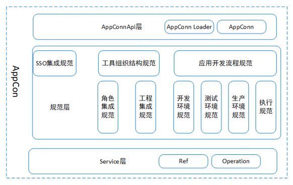
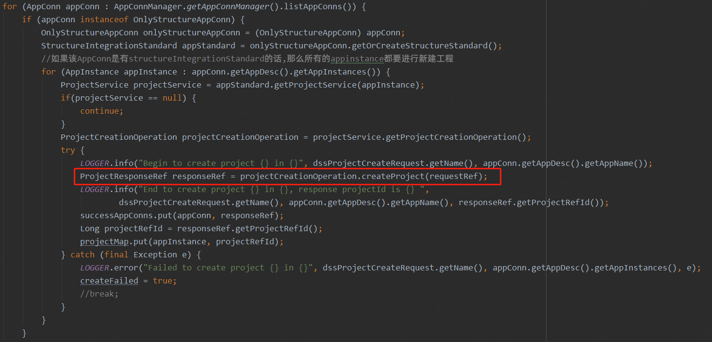

# 第三方系统如何接入 DSS？

## 一、前言

第三方系统通过实现一个 ```AppConn``` 来接入 DSS，DSS 提供了多种 ```AppConn``` 用于方便不同应用场景的第三方系统的快速接入。

以下是各种 ```AppConn``` 的详细介绍：

- ```OnlySSOAppConn```。如果您的第三方系统只想与 DSS 完成 SSO 免登录跳转，则只需继承该 AppConn 即可。
- ```OnlyStructureAppConn```。如果您的第三方系统想与 DSS 统一组织结构，如：工程的统一创建、更新、删除等管理操作，角色权限管理的统一管理，则需继承该 AppConn。
- ```SchedulerAppConn```。该 AppConn 是 ```OnlySSOAppConn``` 和 ```OnlyStructureAppConn``` 的子类，用于将一条 DSS 工作流同步给第三方调度系统，补充 DSS 工作流的调度能力；如果您想对接其他调度系统，则需实现该 AppConn。
- ```OnlyDevelopmentAppConn```。如果您的第三方系统想作为 DSS 工作流的一个节点集成进来，则需实现该 AppConn。
- ```SecondlyAppConn```。是 ```OnlySSOAppConn``` 和 ```OnlyStructureAppConn``` 的子类，表示第三方系统既想打通 SSO，又想打通组织结构。
- ```ThirdlyAppConn```。是 ```OnlySSOAppConn```、```OnlyStructureAppConn``` 和 ```OnlyDevelopmentAppConn``` 的子类，表示第三方系统既想打通 SSO 和组织结构，又想作为 DSS 工作流的一个节点集成进来。

您可以根据实际需要，选择对应的 ```AppConn``` 进行实现。

## 二、详细介绍

```AppConn``` 的具体实现包含以下几个层面，第一层是 ```AppConn``` 层，第二层是 ```AppStandard``` 规范层，第三层是 ```Service``` 层，第四层是 ```Operation``` 层，主要的业务逻辑都是在 ```Operation``` 层实现的, 参数的传递统一采用的是 ```Ref``` 实现类。



### 2.1 OnlySSOAppConn —— 打通 SSO 免登录跳转

DSS 提供了 SSO 免登录跳转的核心 SSO Jar 包，第三方系统需引入该 SSO Jar 包，且在 Filter 中信任 DSS 用户，即可完成用户免登录跳转。

DSS SSO 免登录跳转的设计方案如下：


目前对接 DSS 的一级 SSO 免登录跳转规范大概有两种方式：一种是 Spring Web 应用的对接方式；另一种则是非 Spring Web 应用的对接方式。

#### 2.1.1 Spring Web 应用实现 DSS 一级规范

定义一个 ```Configuration```，如下图：

```java
@Configuration
public class DSSConfiguration {

    @Bean
    Public FilterRegistrationBean<SSOPluginFilter> dssSSOFilter(@Autowired SSOPluginFilter ssoPluginFilter) { 
        FilterRegistrationBean<SSOPluginFilter> filter = new FilterRegistrationBean<>();
        filter.setName("dssSSOFilter");
        filter.setFilter(ssoPluginFilter); 
        // 指定优先级，顺序必须在第三方应用的用户登录判断Filter之前 
        filter.setOrder(-1); 
        return filter; 
    }
} 

```

请注意：如果以依赖注入的方式引入 ```@Autowired SSOPluginFilter ssoPluginFilter```，则需将 ```com.webank.wedatasphere``` 加入到 SpringBoot main class 的 ```@ComponentScan(basePackages=”com.webank.wedatasphere”)``` 之中；否则，请直接使用以下方式：
```java
@Configuration
public class DSSConfiguration {

    @Bean
    Public FilterRegistrationBean<SSOPluginFilter> dssSSOFilter() { 
        FilterRegistrationBean<SSOPluginFilter> filter = new FilterRegistrationBean<>();
        filter.setName("dssSSOFilter");
        filter.setFilter(new SpringOriginSSOPluginFilter()); 
        // 指定优先级，顺序必须在第三方应用的用户登录判断Filter之前 
        filter.setOrder(-1); 
        return filter; 
    }
} 
```

#### 2.1.2 非 Spring Web 应用

需自己继承 ```OriginSSOPluginFilter```，并将该 filter 加入到 Web 容器之中，其顺序必须在第三方应用的用户登录判断 Filter 之前。

具体代码参考如下图所示：
https://github.com/WeBankFinTech/Schedulis/blob/branch-0.6.1/azkaban-web-server/src/main/java/azkaban/webapp/servlet/DSSOriginSSOFilter.java


#### 2.1.3 实现 UserInterceptor

请注意：不管是 Spring Web 应用，还是非 Spring Web 应用，都需要实现一个 ```UserInterceptor ```。

根据不同的场景，DSS 提供了以下的三种 ```UserInterceptor``` 次级接口：

- ```DSSInternalUserInterceptor```：如果第三方应用为 DSS 内部应用，则实现该接口；
- ```HttpRequestUserInterceptor```：如果第三方应用的用户登录信息(如：User 对象)，是存储在 cookies 里面，则需要实现该接口，该接口主要的目的是希望第三方系统将 user 写入到 ```HttpServletRequest``` 之中并返回，这样后面的 Filter 就能在 cookie 中检测到用户而直接放行，可参考 Schedulis 的实现：https://github.com/WeBankFinTech/Schedulis/blob/branch-0.6.1/azkaban-web-server/src/main/java/azkaban/webapp/servlet/WTSSHttpRequestUserInterceptor.java
- ```HttpSessionUserInterceptor```：如果第三方应用的用户登录信息(如：User 对象)，是存储在 HttpSession 里面，则需要实现该接口，该接口主要的目的是希望第三方系统将 user 写入到 ```HttpSession``` 之中，这样后面的 Filter 就能在 cookie 中检测到用户而直接放行；

请注意：**如果是 Spring Web 应用，还需将实现的 ```UserInterceptor``` 以 ```@Component``` 标识，以便 ```SpringOriginSSOPluginFilter``` 能够正常加载到该 ```UserInterceptor```。**

### 2.2 OnlyStructureAppConn —— 接入 DSS 组织结构规范

工具组织结构规范主要包含了工程集成规范和角色集成规范，目前主要可以参考 ```VisualisAppConn``` 的实现。

如工程集成规范实现了工程的统一创建、更新、删除操作，工程规范如下图所示：


具体代码参考如下图所示：
https://github.com/WeBankFinTech/DataSphereStudio/blob/branch-1.0.0/dss-standard/structure-standard/dss-structure-integration-standard/src/main/java/com/webank/wedatasphere/dss/standard/app/structure/AbstractStructureIntegrationStandard.java

### 2.3 OnlyDevelopmentAppConn —— 接入 DSS 开发流程规范

应用开发流程规范目前主要体现在工作流节点上，工作流节点的增删改查操作、导入导出操作，节点实时执行，以及 Kill 操作等。

应用开发流程规范也可以根据场景需要，形成开发，测试，生产流程规范。现在开发流程规范主要包括了 ```RefCRUDService```、```RefExecutionService```、```RefExportService```、```RefImportService``` 等服务。


具体代码参考如下图所示：
https://github.com/WeBankFinTech/DataSphereStudio/blob/master/dss-appconn/appconns/dss-visualis-appconn/src/main/java/com/webank/wedatasphere/dss/appconn/visualis/VisualisDevelopmentIntegrationStandard.java

## 三、数据库内容介绍

主要修改涉及的表包括：dss_appconn、dss_appconn_instance、dss_workflow_node、dss_workflow_node_to_group、dss_workflow_node_to_ui 等。如下是 ```VisualisAppConn``` 的 ```display``` 节点新增为工作流节点需要修改的数据库操作。

```mysql-sql
delete from  `dss_appconn` where `appconn_name`='visualis';
INSERT INTO `dss_appconn` (`appconn_name`, `is_user_need_init`, `level`, `if_iframe`, `is_external`, `reference`, `class_name`, `appconn_class_path`, `resource`) VALUES ('visualis', 0, 1, NULL, 0, NULL, 'com.webank.wedatasphere.dss.appconn.visualis.VisualisAppConn', 'DSS_INSTALL_HOME_VAL/dss-appconns/visualis/lib', '');

select @dss_appconn_visualisId:=id from `dss_appconn` where `appconn_name` = 'visualis';

delete from `dss_appconn_instance` where `homepage_url` like '%visualis%';
INSERT INTO `dss_appconn_instance` (`appconn_id`, `label`, `url`, `enhance_json`, `homepage_url`, `redirect_url`) VALUES (@dss_appconn_visualisId, 'DEV', 'http://APPCONN_INSTALL_IP:APPCONN_INSTALL_PORT/', '', 'http://APPCONN_INSTALL_IP:APPCONN_INSTALL_PORT/dss/visualis/#/projects', 'http://APPCONN_INSTALL_IP:APPCONN_INSTALL_PORT/');

delete from `dss_workflow_node`  where `node_type` like '%visualis%';
insert into `dss_workflow_node` (`name`, `appconn_name`, `node_type`, `jump_url`, `support_jump`, `submit_to_scheduler`, `enable_copy`, `should_creation_before_node`, `icon`) values('display','visualis','linkis.appconn.visualis.display','http://APPCONN_INSTALL_IP:APPCONN_INSTALL_PORT/dss/visualis/#/project/${projectId}/display/${displayId}','1','1','0','1',<?xml version=\"1.0\" encoding=\"UTF-8\"?><svg</svg>);

select @dss_visualis_displayId:=id from `dss_workflow_node` where `node_type` = 'linkis.appconn.visualis.display';

delete from `dss_workflow_node_to_group` where `node_id`=@dss_visualis_displayId;

delete from `dss_workflow_node_to_ui` where `workflow_node_id`=@dss_visualis_displayId;

select @dss_visualis_displayId:=id from `dss_workflow_node` where `node_type` = 'linkis.appconn.visualis.display';

INSERT INTO `dss_workflow_node_to_group`(`node_id`,`group_id`) values (@dss_visualis_displayId,4);
```

以上是 ```VisualisAppConn``` 的 DDL 和 DML SQL，新的第三方系统在接入时，可参考该 SQL 脚本进行修改，并写入到 ```init.sql``` 文件之中。

## 四、AppConn 如何添加到 DSS

- 使用 AppConn 部署脚本 ```sh install-appconn.sh```，前提是 AppConn 已经打包好，并包含了 init.sql 可以支持数据库的更新。可参考 ```VisualisAppConn``` 的插件安装文档：
https://github.com/WeBankFinTech/DataSphereStudio-Doc/blob/main/zh_CN/%E5%AE%89%E8%A3%85%E9%83%A8%E7%BD%B2/VisualisAppConn%E6%8F%92%E4%BB%B6%E5%AE%89%E8%A3%85%E6%96%87%E6%A1%A3.md

- 如有前端交互，如节点双击打开，目前都是使用 Iframe 的方式嵌入的，在第三方系统编辑任务后，需要把结果返回给 DSS，并保存工作流 Json 的 ```jobContent``` 字段中，这部分设计到第三方系统的前端修改，可参考已有的 ```VisualisAppConn``` 的前端节点编辑来做。

## 五、架构介绍：DSS 如何使用 AppConn 和第三方应用进行关联

DSS 同第三方应用系统的交互都是通过相应的 AppConn 实例来完成的，当 AppConn 被部署到指定目录后，dss-framework-project-server 服务启动时会负责加载所有的 AppConn，并把它存入物料库，其它服务以客户端的形式进行拉取，并动态加载到服务进程，作为 AppConn 实例被调用。


DSS 目前实现的是框架层的代码，通过统一的调用方式来访问 AppConn 里面的对应的接口，接口的入口参数和返回值都是确定的。

如下图所示：



