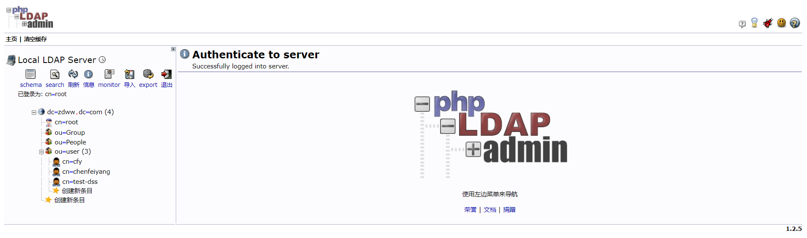
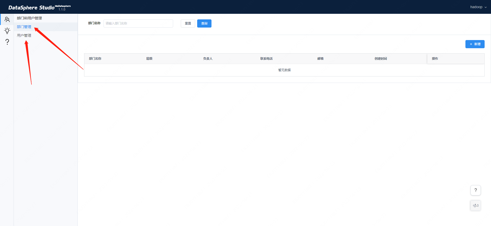

# DataSphere Studio 新增用户的方式

> DSS 默认只提供了管理员账号，用户登录鉴权依托于 Linkis 的 LDAP 用户登录认证体系，本文将详细介绍如何新增一个全新的 DSS 用户。

## 一、基本介绍

DSS 超级管理员的用户名为部署用户名，如部署用户为 hadoop，则管理员的用户名和密码为 hadoop/hadoop，具体用户可在 [DSS单机部署文档](../安装部署/DSS&Linkis一键部署文档单机版.md) 查看。

新增一个 DSS 用户主要分为以下几步：

- DSS接入LDAP认证体系
- 新增 LDAP 用户
- 为新用户完善环境信息

## 二、DSS接入LDAP认证体系

1.首先要搭建好LDAP服务端，确保LDAP服务可用，能正常新增用户。如下图所示（以ldapadmin客户端展示为例）：


2.需要在dss.properties配置文件添加ldap相关配置(替换ip，密码字段)

wds.dss.ldap.admin.name=cn=root,dc=zdww,dc=com

wds.dss.ldap.admin.password=XXXX

wds.dss.ldap.url=ldap://10.18.XX.XX:389/

wds.dss.ldap.base.dn=ou=user,dc=zdww,dc=com

## 三、新增 LDAP 用户

DSS 超级管理员可以在首页创建部门和用户，建立公司的层级及人员管理体系，创立的部门和用户。如下图所示：


#### 创建部门和用户：

在超级管理员首页点击【管理台】，进入管理台页面。

超级管理员可以新建、修改和删除部门（请注意：部门层级最多可建立四级，包括元公司在内），元公司无法删除，仅可修改信息。

同时，超级管理员可以进行用户的新建，修改和用户密码重置。

如下图所示：



当您在页面创建一个用户后，DSS 后台会自动请求 LDAP，为您在 LDAP 中创建一个同名用户。

## 四、为新用户完善环境信息

1. 由于 DSS & Linkis 做了自上而下的多租户隔离，为了使登录的用户可正常使用 DSS，还需在 Linux 服务器上面创建对应的 Linux 用户，具体步骤如下：

- 在所有Linkis & DSS 服务器上创建对应 Linux 用户。
- 如果使用了 Hadoop，还需在 Hadoop 的 NameNode 创建对应 Linux 用户。
- 保证 Linkis & DSS 服务器上的 Linux 用户，可正常使用 `hdfs dfs -ls /` 等命令，同时该用户需要能正常执行 `spark-sql -e` 和 `hive -e` 等 shell 命令。
- 由于每个用户的工作空间严格隔离，您还需为该用户创建工作空间和 HDFS 目录，如下：

```shell script
## 创建用户工作空间目录和授权
mkdir $WORKSPACE_USER_ROOT_PATH/${NEW_USER}
chmod 750 $WORKSPACE_USER_ROOT_PATH/${NEW_USER}

## 创建用户HDFS目录和授权
hdfs dfs -mkdir $HDFS_USER_ROOT_PATH/${NEW_USER}
hdfs dfs -chown ${NEW_USER}:${NEW_USER} $HDFS_USER_ROOT_PATH/${NEW_USER}
hdfs dfs -chmod 750 $HDFS_USER_ROOT_PATH/${NEW_USER}
```

`WORKSPACE_USER_ROOT_PATH` 和 `HDFS_USER_ROOT_PATH` 是您一键安装 DSS 时，设置的工作空间和 HDFS 根路径。

如果您没有设置，则默认为：

```shell script
WORKSPACE_USER_ROOT_PATH=file:///tmp/linkis
HDFS_USER_ROOT_PATH=hdfs:///tmp/linkis
```
