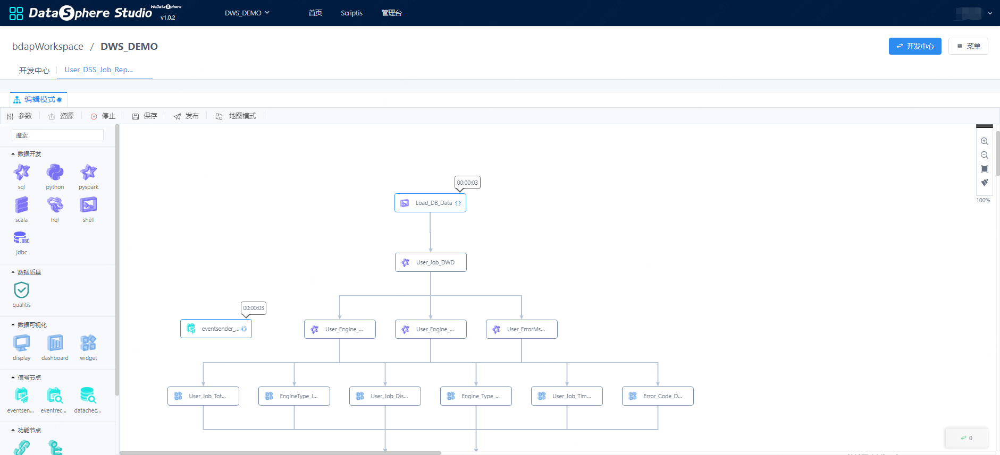

DSS-工作流使用文档
------

## 简介
&nbsp;&nbsp;&nbsp;&nbsp;&nbsp;&nbsp;&nbsp;&nbsp;数据工作流（Workflow），指把数据的提取转换工程"业务过程的部分或整体在计算机应用环境下的自动化"，对于数据分析及加工等场景可以带来极大的便利。  
&nbsp;&nbsp;&nbsp;&nbsp;&nbsp;&nbsp;&nbsp;&nbsp;DSS工作流相比较交互式分析极大的简化了数据处理任务，工作流的优点可以简化为以下三点：

1. 能自动跑批建好中间表数据表，方便数据使用。
2. 在数据就绪后自动开始跑数，定时批量数据加工。
3. 工作流自动化展示数据制作成报表并数据输出。


## 工作流功能简介
&nbsp;&nbsp;&nbsp;&nbsp;&nbsp;&nbsp;&nbsp;&nbsp;进入DSS工作流编辑页面可以提过拖拽的方式开发工作流，每个节点之前执行顺序需要提过节点连线控制。如果需要调试相关节点，配置完成该节点后，执行调试该节点，判断任务配置是否正确。  
&nbsp;&nbsp;&nbsp;&nbsp;&nbsp;&nbsp;&nbsp;&nbsp;SQL、HQL等脚本节点，双击进入编辑之后就可以点击执行进行运行,可以通过结果来检验脚本是否是正确（不会触发整个工作流）。当编辑完一条工作流之后，在页面直接点击执行按钮进行工作流的实时执行，这一步骤可以检验整个工作流是否能够完全运行起来。  
&nbsp;&nbsp;&nbsp;&nbsp;&nbsp;&nbsp;&nbsp;&nbsp;所有的流节点通过托拉拽的方式置于右方的空白区域，将工作流节点放置在界面之后，鼠标移动到单个节点上时，流节点会出现4个圆点，点击圆点引出一条线后可以连接至另一个流节点，连线的方向和顺序确定了工作流节点的执行顺序。


&nbsp;&nbsp;&nbsp;&nbsp;&nbsp;&nbsp;&nbsp;&nbsp;工作流开发调试结束后，点击发布，工作流会把工作流提交到Schedulis，在Schedulis找到该项目设置调度参数即可调度该工作流。

## 工作流节点介绍

### Spark节点  
&nbsp;&nbsp;&nbsp;&nbsp;&nbsp;&nbsp;&nbsp;&nbsp;&nbsp;分别支持sql、pyspark、scala三种方式执行spark任务，使用时只需将节点拖拽至工作台后编写代码即可。
### Hive节点  
&nbsp;&nbsp;&nbsp;&nbsp;&nbsp;&nbsp;&nbsp;&nbsp;&nbsp;hive节点支持sql方式执行hive任务，使用时只需将节点拖拽至工作台后编写hivesql代码即可。
### python节点   
&nbsp;&nbsp;&nbsp;&nbsp;&nbsp;&nbsp;&nbsp;&nbsp;&nbsp;python节点支持执行python任务，使用时只需将节点拖拽至工作台后编写python代码即可。
### shell节点  
&nbsp;&nbsp;&nbsp;&nbsp;&nbsp;&nbsp;&nbsp;&nbsp;&nbsp;shell节点支持执行shell命令或者脚本运行，使用时只需将节点拖拽至工作台后编写shell命令即可。
### jdbc节点  
&nbsp;&nbsp;&nbsp;&nbsp;&nbsp;&nbsp;&nbsp;&nbsp;&nbsp;jdbc节点支持以jdbc方式运行sql命令，使用时只需将节点拖拽至工作台后编写sql即可，**注意需要提前在linkis console管理台配置jdbc连接信息。**

### 信号节点
&nbsp;&nbsp;&nbsp;&nbsp;&nbsp;&nbsp;&nbsp;&nbsp;&nbsp;EventSender节点用于进行信息发送，将一段信息事件进行发送给EventReceiver。

&nbsp;&nbsp;&nbsp;&nbsp;&nbsp;&nbsp;&nbsp;&nbsp;&nbsp;常见场景如：工程间存在上下游依赖，工作流间存在上下游信息依赖。比如B工作流的某个工作流节点依赖于A工作流的某个工作流节点的一些信息（如：状态信息，即A节点执行成功，B节点才能开始执行），eventSender支持如下参数：

```xml
1. msg.type: 用来指定Job的类型，SEND用于发送消息，RECEIVE用于接收消息
2. msg.sender: 指定消息的发送者，需使用ProjectName@WFName@JobName的格式进行定义
3. msg.topic: 指定消息的主题，建议使用如下格式： 一级分类编码+_+二级分类编码+_+三级分类编码
4. msg.name: 指定消息名称，由用户自定义
5. msg.body: 指定消息的内容，没有内容发送可以为空
6. **注意：msg.type默认不可变为SEND，msg.sender、msg.topic、msg.name是必填**
```

示例：
```xml
msg.type=SEND
msg.sender=project01@flow@job01
msg.topic=bdp_tac_test
msg.name=TestDynamicReceive
msg.body=${msg.mycontent}
```
&nbsp;&nbsp;&nbsp;&nbsp;&nbsp;&nbsp;&nbsp;&nbsp;&nbsp;EventReceiver节点用于接收eventSender发送过来的消息，并将接收过来的消息内容存放到工作流的上下文中，后续的节点会根据前缀去找该信息进行使用比如作为自定义变量进行使用，eventReceiver支持如下参数：

```xml
1. msg.type: 用来指定Job的类型，SEND用于发送消息，RECEIVE用于接收消息
2. msg.receiver: 指定消息的接收者，需使用projectname@jobname@rtxname的格式进行定义
3. msg.topic: 指定消息的主题，建议使用如下格式： 一级分类编码+_+二级分类编码+_+三级分类编码
4. msg.name: 指定消息名称，由用户自定义
5. query.frequency: 由于接收消息使用的是主动轮询的方式，wait.time期间的查询次数
6. max.receive.hours: 最长的接收时长，以小时为单位，超过时长未接收到消息返回失败
7. msg.savekey: 用于保存消息内容key值，单个flow内多个接收job，需指定不同的msg.savekey保存消息内容，默认值为msg.body，后续Job可以使用该key值获取消息内容
8. only.receive.today: 如果为true 有且只能接收job启动当天发来的消息
9. 注意：msg.type默认不可变为RECEIVE，msg.receiver、msg.topic、msg.name是必填
```

### DataCheck节点：
&nbsp;&nbsp;&nbsp;&nbsp;&nbsp;&nbsp;&nbsp;&nbsp;&nbsp;DataCheck节点用于检测数据是否ready，可以判断hive库中某个表或者分区是否存在，如果存在则进行下游的执行，在有数据依赖的任务中扮演十分重要的作用，用于替换掉以前口头约定好的时间开始运行。

&nbsp;&nbsp;&nbsp;&nbsp;&nbsp;&nbsp;&nbsp;&nbsp;&nbsp;dataCheck支持如下参数：
```
1. source.type: 依赖的数据来源
2. check.object: 依赖数据的名称例如：data.object.1=dbname.tablename{partitionlist}
3. max.check.hours: 描述任务的等待时间，单位是小时
4. job.desc: 追加多源信息配置
```

### SendEmail节点
&nbsp;&nbsp;&nbsp;&nbsp;&nbsp;&nbsp;&nbsp;&nbsp;&nbsp;SendEmail节点一般作为工作流的最后一个节点，用于将工作流前面的结果信息进行发送，支持发送表格、文本、DashBoard、Display、图片等，用户在使用的时候直接选择想要发送的工作流节点即可，目前在DSS工作流中需要配合Visualis第三方节点DashBoard、Display使用。  
&nbsp;&nbsp;&nbsp;&nbsp;&nbsp;&nbsp;&nbsp;&nbsp;&nbsp;sendEmail支持如下参数：
```
类型：支持节点、文字、文件、链接
邮件标题：指定邮件表提
发送项：发送的具体内容，例如：类型是节点则这里选择节点
关联审批单：该邮件是否走过审批，如果未则不会进行发送
其他邮件基本属性：收件人、抄送、秘密抄送
```

### 连接节点
&nbsp;&nbsp;&nbsp;&nbsp;&nbsp;&nbsp;&nbsp;&nbsp;&nbsp;Connector节点的作用是为了作为节点与节点的连接，调整工作流布局，并不具有特殊功能。

### 子工作流节点
&nbsp;&nbsp;&nbsp;&nbsp;&nbsp;&nbsp;&nbsp;&nbsp;&nbsp;Subflow节点是您可以在一条工作流中嵌入一条子工作流，父工作流发布时，子工作流也会同步进行发布，但是在实时执行父工作流时，会跳过子工作流的执行。  
&nbsp;&nbsp;&nbsp;&nbsp;&nbsp;&nbsp;&nbsp;&nbsp;&nbsp;如果您想执行子工作流，请双击子工作流节点，进入子工作流编辑页面进行执行。

### 第三方节点
&nbsp;&nbsp;&nbsp;&nbsp;&nbsp;&nbsp;&nbsp;&nbsp;&nbsp;第三方节点需要按照对应的第三方系统，配置AppConn安装包，及插入AppConn表相关字段后使用。
