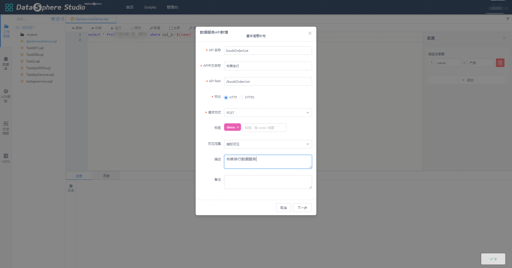
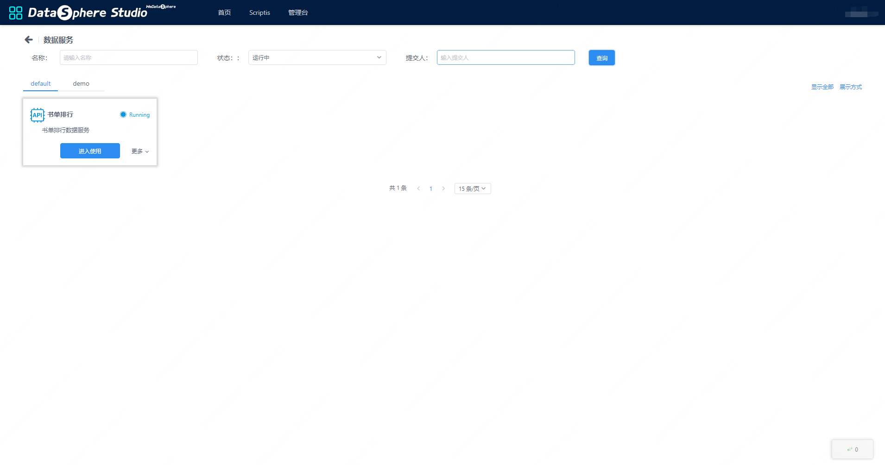
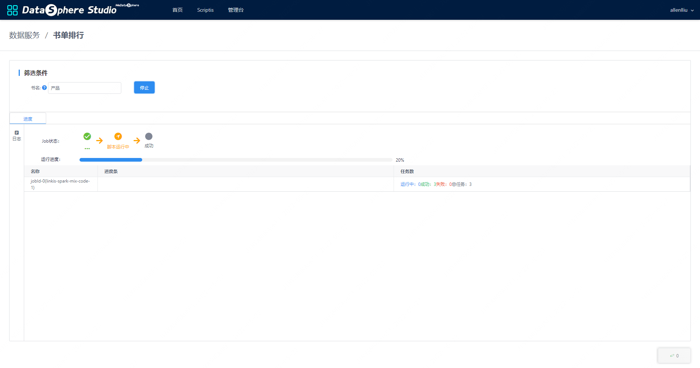
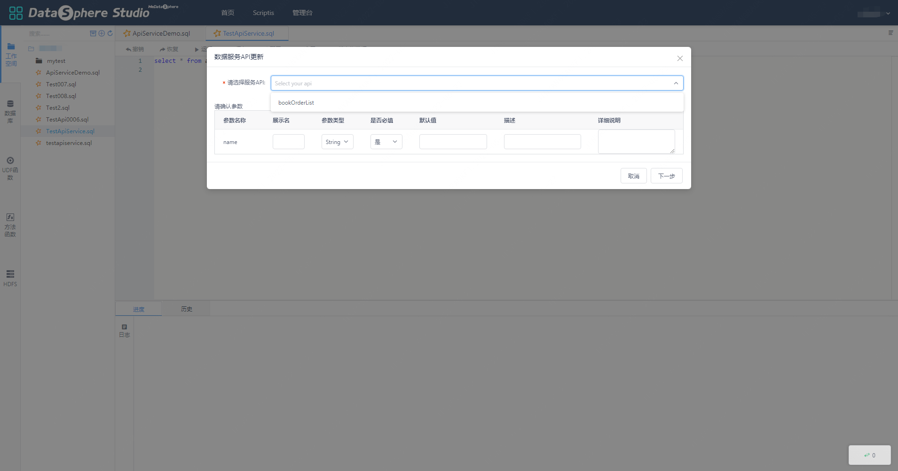
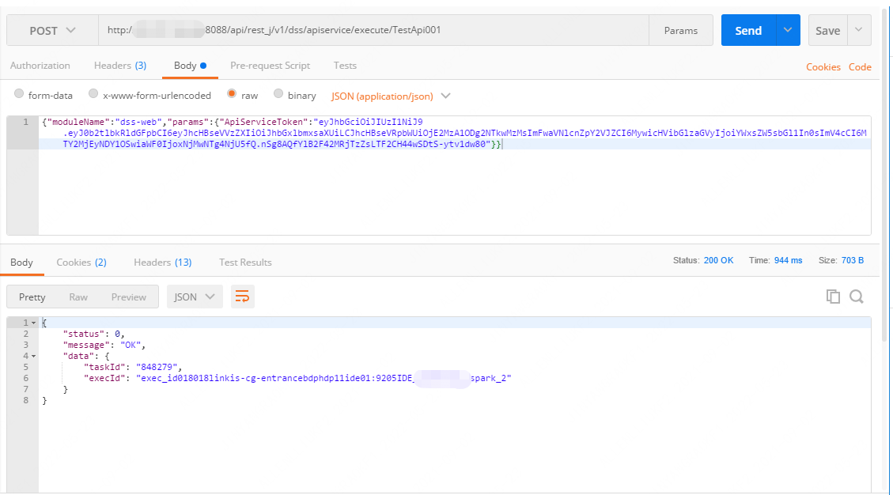
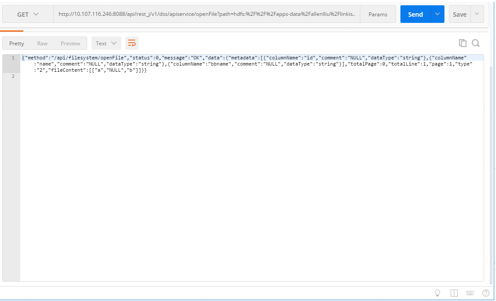

数据服务
----------

&nbsp;&nbsp;&nbsp;&nbsp;&nbsp;&nbsp;&nbsp;&nbsp;DSS目前支持将SQL脚本发布成数据服务API，分享给其他用户使用。业务用户可以在不用写代码和无大数据平台用户的情况下，设置参数，就可以执行数据服务的脚本，并直接浏览或者下载平台数据。
数据服务是具有库表权限的用户，提供给没有库表权限用户的一种服务，本文将从发布数据服务用户（简称发布用户），和使用数据服务用户（简称使用用户）两种不同的角度进行说明。
因为业务的需要，数据服务在使用上，会有如下限制：
* 仅支持Spark SQL的查询语句
* 不支持多结果集查询
* 只支持查询SELECT语句
* 只能含有一条SQL语句
* SQL语句中末尾不允许出现分号 

&nbsp;&nbsp;&nbsp;&nbsp;&nbsp;&nbsp;&nbsp;&nbsp;除上述限制，以下写法是允许的。
```sql
USE DATABASE default;
SELECT * FROM default.book
```

**1、创建数据服务**

&nbsp;&nbsp;&nbsp;&nbsp;&nbsp;&nbsp;&nbsp;&nbsp;由于业务的需要，需要建立一个数据服务，授权给他人使用，当发布用户进入Scriptis，编辑新建脚本文件，编写Spark SQL语句，同时在SQL语句中嵌入变量，方便后续的业务人员自己设置参数后就可以获取数据。
&nbsp;&nbsp;&nbsp;&nbsp;&nbsp;&nbsp;&nbsp;&nbsp;在保存该Spark SQL脚本后，可在脚本编辑栏上方点击"发布为数据API"（该"发布为数据API"的功能，只有部分用户具有该权限，不具备权限的用户，该功能按钮不可见），新建API信息填写如下图所示。


点击下一步，用于设置变量的信息。


发布用户可以在工作空间的主页，通过应用工具，进入"数据服务"应用使用数据服务，在数据服务的标签点击"更多"，可以进入数据服务管理界面




**2、使用数据服务**

&nbsp;&nbsp;&nbsp;&nbsp;&nbsp;&nbsp;&nbsp;&nbsp;在进入数据服务页面后，可以看到该用户可使用的数据服务列表页面，其中default表示默认所有的数据服务，用户可以点击对应的标签筛选出自己需要使用的数据服务，同时可以在搜索框中，分别用名称、状态、提交人进行筛选，

&nbsp;&nbsp;&nbsp;&nbsp;&nbsp;&nbsp;&nbsp;&nbsp;使用用户点击"进入使用"，可以在筛选条件中，设置参数的值，使用用户是发布用户数据集的一个子集。



**3、修改数据服务**

&nbsp;&nbsp;&nbsp;&nbsp;&nbsp;&nbsp;&nbsp;&nbsp;一个数据服务由于业务的需要可能发生修改，当发布用户对数据服务的脚本进行了修改，可以点击"更新数据API"。
更新数据服务，可以选择绑定的其他数据服务。


**4、使用postman访问数据服务**

数据服务发布后，支持使用api接口访问，可以给其它系统直接调用。提交查询如下图所示：



获取到任务执行ID, 再根据ID可以获取任务的执行进度，日志，结果集等。



说明：数据服务的token可以从/queryById?的接口返回(点击进入使用)，字段为userToken.  所有接口的访问都是要经过GateWay认证的。数据服务的token只能用于数据服务的管理流程。使用postman的认证需要使用页面的cookie后者走linkis-gateway的秘钥认证方式。在head 里面加入Token-Code: XXX   这里指定linkis-gateway的登录秘钥   Token-User: XXX   这里指定linkis-gateway的登录用户。


