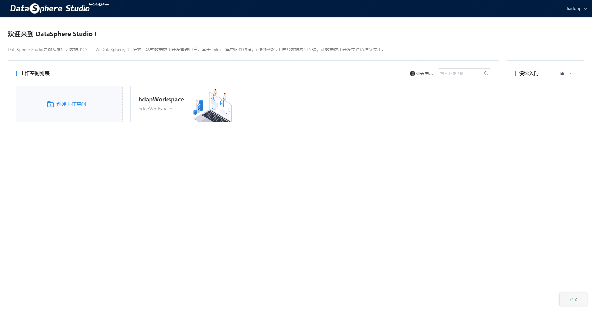

## DSS User Document

## 动机
&nbsp;&nbsp;&nbsp;&nbsp;DSS1.x版本是一个里程碑版本，在DSS0.x的基础上进行了大量优化和重构，由于篇幅有限，只能涵盖DSS的基本使用流程，更多的操作使用细节，希望和社区伙伴们一起完善优化，在使用的过程中有任何问题和建议，可以随时联系微众银行大数据平台的相关社区开源人员，我们致力于打造更好的一站式大数据套件，为大数据开源生态贡献自己的力量。

## 前言
&nbsp;&nbsp;&nbsp;&nbsp;DSS1.x版本对前端页面交互进行了重构和优化，本文档是DSS的用户使用手册，涵盖了DSS1.0的基本使用流程，更多的操作使用细节，请参考各个模块的的文档。
&nbsp;&nbsp;&nbsp;&nbsp;用户文档主要分为以下几个文档，分别是：  
1. [Scriptis使用文档]()  
2. [工作流使用文档]()
3. [数据服务使用文档]()
4. [Linkis管理台使用手册]()

## 管理模块介绍
## 登录首页
&nbsp;&nbsp;&nbsp;&nbsp;为了方便用户使用，系统默认通过Linkis的Linux部署用户进行登录，如使用hadoop部署的Linkis和DSS，可以直接通过用户：hadoop，密码：hadoop(密码就是用户名)登录。 输入DSS前端地址后，127.0.0.1:8088 输入用户名密码：hadoop hadoop，即可登录，登录页提供DSS用户访问权限验证功能。
  
*注意： 如果要支持多用户登录，DSS的用户登录依赖Linkis，需要在linkis-GateWay的配置里面进行配置，Linkis-GateWay默认支持LDAP。*

## 工作空间
&nbsp;&nbsp;&nbsp;&nbsp;进入到工作空间页面，可以创建和管理工作空间。工作空间是DSS最顶层的概念，比较直观的例子比如，工作空间可以是一个部门，一个业务线，或者是一个组织，用来管理数据应用，包括人员，工程，或者组件，每个工作空间会有工作空间管理员的角色权限，可以对工作空间的进行管理，控制工作空间的组件和人员权限。
  

## 工程管理
&nbsp;&nbsp;&nbsp;&nbsp;在进入相应的工作空间后，会跳转到工程首页，在工程首页，可以创建工程，在实际的开发生产中，工程往往被用来管理开发一类数据应用，包括工作流，单任务等，每个工作空间下的工程互相隔离。在实际应用中，为每一个数据应用划分一个工程，是较为理想的方式。
 

