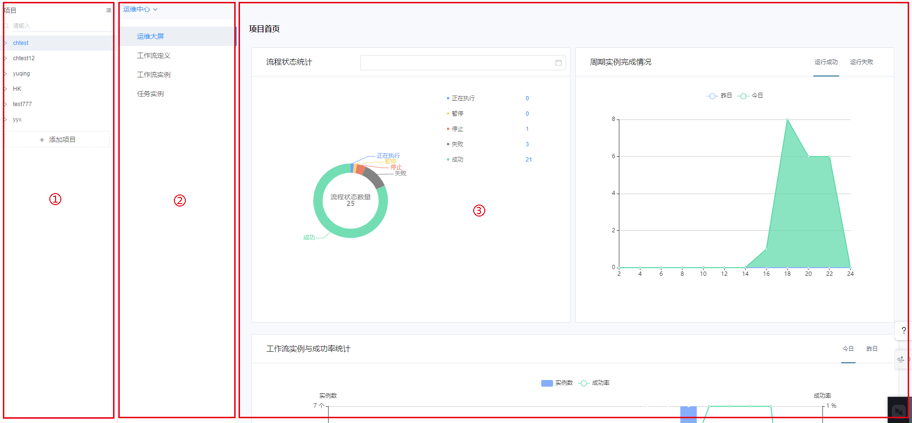
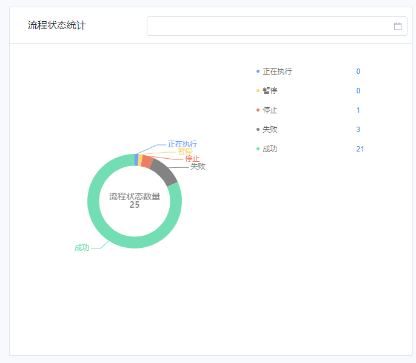
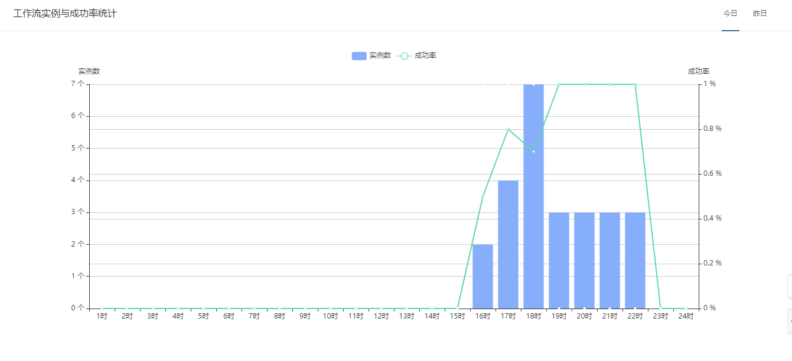
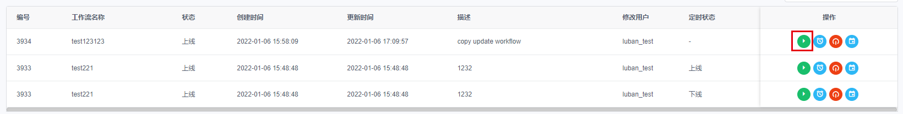
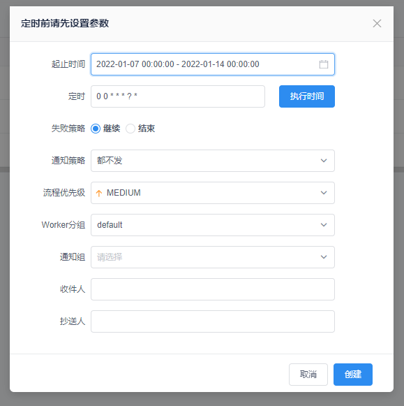
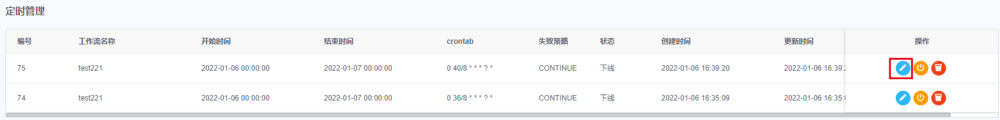
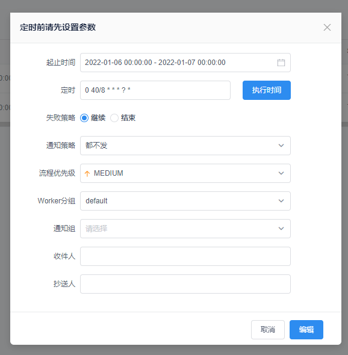
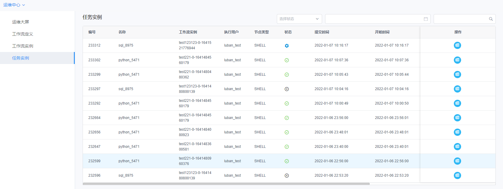
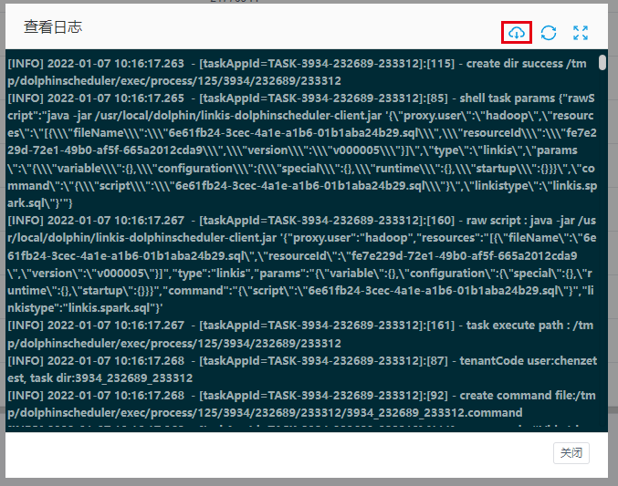

# 调度中心使用文档

调度中心是可视化的工作流调度平台，运维大屏功能可实时可视化监控并统计工作流任务的运行状态，调度功能支持对工作流进行运行。

定时管理、上线和下线等操作，还支持对工作流进行管理，执行例如重跑、恢复、终止、暂停等操作。

日志功能支持对工作流的日志信息进行查看和下载等操作。

**请注意：如您想使用调度中心，请先安装 DolphinSchedulerAppConn。** [如何安装 DolphinSchedulerAppConn](../安装部署/DolphinScheduler插件安装文档.md)

## 页面概述

 调度中心页面如下所示。

运维中心首页各区域的功能如下：

- ①项目与工作流列表：页面左侧列表显示工空间下所有项目及工作流，可以在此进行项目切换；
- ②功能模块列表：此区域以项目为单位展示项目下的运维大屏、工作流定义、工作流实例和任务实例；
- ③操作区域：在此区域中执行对具体功能的操作；

## 运维大屏

运维大屏用以展示整个项目下不同时间段内所有工作流的统计图表监控信息，分别展示了流程状态统计信息、周期实例完成情况、工作流实例与成功率统计和流程定义统计。

操作步骤如下：

1. 登录平台，进入运维中心，选择 “运维大屏”
2. 查看当前选中项目下的工作流统计信息，不同信息的含义和操作如下：

#### 2.1 流程状态统计

统计选中项目下所有工作流实例的运行情况，并以饼图形式展示。

用户可点击**日期图标**选择统计时间段

#### 2.2 周期实例完成情况

统计选中项目下周期实例的任务执行情况，其中横轴为时间，纵轴为周期实例数量。用户可在右上角点击【运行成功】或【运行失败】来切换需要查看的周期实例。

#### 2.3 工作流实例与成功率统计

统计选中项目下的不同时间段的执行工作流实例数量和成功率信息，其中横轴为时间，纵轴为实例数量和成功率。用户可在右上角点击【今日】和【昨日】以切换要查看的日期。

#### 2.4 流程耗时排名

展示相应时间段已有结束时间的任务实例的耗时的降序排行情况。

## 工作流定义

工作流定义展示了当前选中项目下定义的所有工作流的信息，可以在操作栏对单个工作流进行运行、定时、上线/下线和定时管理等操作。

- 1. 如何运行当前选中的工作流？

选择需要运行的工作流所在行，点击操作栏的 **运行** 按钮。

- 2. 如何定时运行工作流？

选择需要运行的工作流所在行，点击操作栏的 **定时** 按钮。

在弹出框中设置参数并配置通知人等信息，填写完成后点击【创建】按钮即可设置定时任务。

- 3. 工作流上线/下线切换

选择未上线的工作流，点击其操作栏的 **上线** 和 **下线** 按钮，进行工作流上下线。

- 4. 定时管理

工作流定时管理可以对工作流历史执行和正在执行的定时服务进行上线/下线切换、删除或编辑等操作。

选择需要进行定时管理的工作流，点击其操作栏的 **定时** 按钮，可进入该工作流的定时管理界面。如下图：

点击 **编辑** 按钮可编辑工作流的定时服务。

## 工作流实例

工作流实例页面以列表形式展示了工作流的状态、运行类型、开始时间、运行时长等信息，并可对工作流的运行状态进行操作。

- 1. 重跑工作流

选择需要重跑的工作流，点击其操作栏的 **重跑** 按钮即可。

- 2. 恢复工作流

选择需要恢复的工作流，点击其操作栏的 **恢复** 按钮即可。

- 3. 终止工作流

选择需要终止的工作流，点击其操作栏的 **终止** 按钮即可。

- 4. 暂停工作流

选择需要暂停运行的工作流，点击其操作栏 **暂停** 按钮即可。

- 5. 删除工作流

选择需要删除运行的工作流，点击其操作栏 **删除** 按钮即可。

- 6. 查看甘特图

查看工作流的甘特图，甘特图由时间和工作流下各节点的运行时间组成。

选择需要查看甘特图的工作流，点击其操作栏 **查看甘特图** 按钮即可。

## 任务实例

任务实例页面以列表形式展示工作流中各个节点任务的基本信息和运行情况，并可查看任务实例的运行日志。

- 1. 查看日志

查看任务实例的运行日志，并支持对日志执行下载、刷新和全屏查看等操作。

点击日志窗口的 **下载** 按钮，可下载日志到本地。

对于正在运行的任务实例，点击日志窗口的 **刷新** 按钮，可实时刷新日志。

点击日志窗口的 **全屏** 按钮，可全屏查看日志。