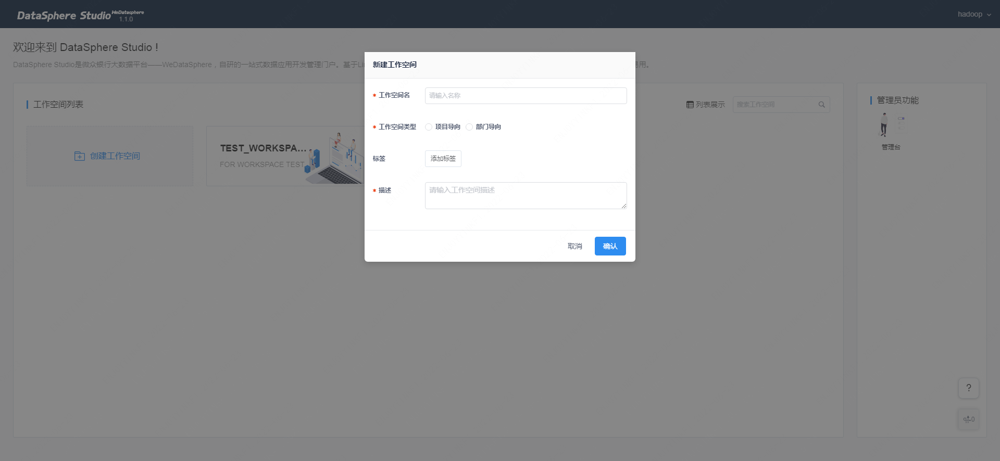

## 工作空间概念

在数据开发与管理中，工作空间的概念类似于团队，一个公司（即主账号）可创建多个工作空间，工作空间作为管理任务、成员，分配角色和权限的基本单元，其内的成员可以在一个工作空间内进行协同开发，运维，分析等。

组织的主账户默认为该组织的工作空间管理员用户，负责管理该组织的工作空间管理控制台，规划工作空间架构，新建、删除工作空间等工作。

超级管理员可以在管理员首页点击【创建工作空间】，进行工作空间的创建操作。

#### 工作空间类型：

工作空间分为项目导向和部门导向两类：

- 项目导向的工作空间参与成员是纵向架构，可以来自不同部门；
- 部门导向的工作空间参与成员是横向架构，来自同一个部门。

在项目导向的工作空间中，可以添加任何部门的成员；

在部门导向的工作空间中，只可以添加本部门的成员。

#### 工作空间管理：

工作空间创建者的默认角色是拥有者，可以委托一名或多名管理员对工作空间进行管理。

只有工作空间的管理员可以进入【工作空间管理】模块，对该工作空间的基本信息和权限信息进行相应管理。