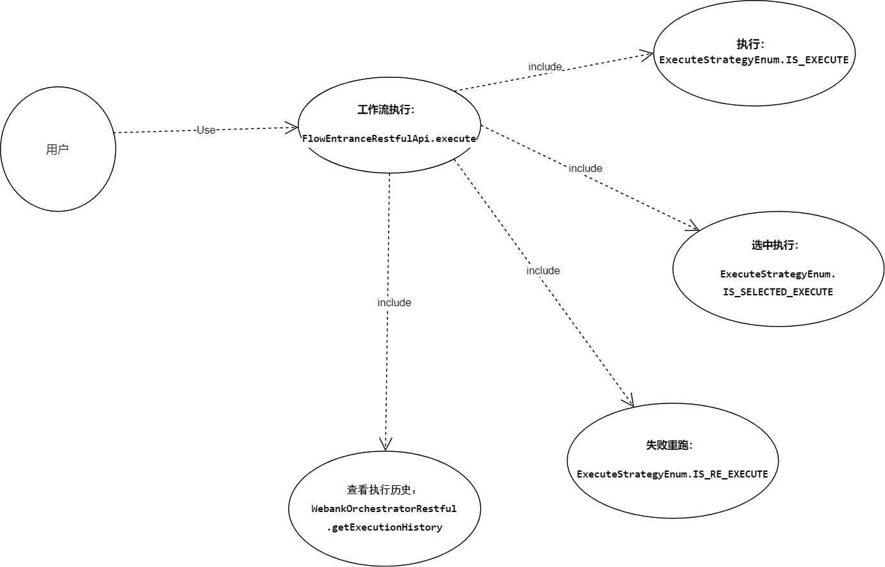

FlowExecution
-------------------------
FlowExecution：工作流实时执行模块，提供工作流执行的接口服务，使用了linkis的Entrance模块，并继承了linkis-entrance的一些类做自适应改造。
如继承了PersistenceEngine实现dss的工作流task的持久化操作、覆写EntranceExecutionJob类实现工作流节点的执行、状态转换、kill等操作。最后通过linkis-computation-client将解析处理后的任务投递到linkis服务。


###2.2 业务架构

用户使用功能点：

| 组件名            |   一级模块            | 二级模块          |  功能点         |
|---------------------|------------------|-----------------|-----------------|
| DataSphereStudio    | 工作流            |  工作流执行        |  执行             |
|                     |                   |                  |    选中执行     |
|                     |                   |                  |   失败重跑       |
|                     |                   |                  | 执行历史查看    |



### 一、FlowExecution接口/类功能介绍：

| 核心接口/类              | 核心功能                            |
|---------------------------|------------------------------|
| FlowEntranceRestfulApi     | 提供了工作流执行的restful接口，如任务执行、状态获取      |
| WorkflowPersistenceEngine  |覆写了linkis的PersistenceEngine的persist方法，将jobRequest转换为workflowTask持久化到dss的workflow_task表                 |
| WorkflowQueryService      | 提供工作流任务的创建、状态更新等接口服务     |
| WorkflowExecutionInfoService   | 提供工作流执行信息的创建、查询等服务   |
| FlowEntranceEngine   | 继承自linkis的Executor，实现了execute方法，会调用flowParser解析flow并作为runJob方法入口   |
| FlowExecutionExecutorManagerImpl   | 继承子linkis的ExecutorManager，重写了createExecutor方法，使创建的executor为dss的FlowEntranceEngine   |
| FlowExecutionParser   | 继承自linkis的CommonEntranceParser，重写了parseToJob方法，使之返回的为dss的FlowEntranceJob   |
| DefaultFlowExecution   | 提供runJob()方法，将FlowEntranceJob的所有已调度节点转换为可运行状态，并将运行节点添加到任务队列，由定时线程池轮询每个节点对应的linkis任务状态，若状态任务完成则从队列移除。   |
| FlowEntranceJobParser   | 定义parse()方法，子类包含多种解析实现类，如从jobRequest解析workflow、解析工作流节点的params属性   |
| FlowEntranceJob   | 继承自linkis的EntranceExecutionJob，重写了run()、kill()、onStatusChanged()等方法，提供job的执行入口以及状态回调处理。   |
| DefaultNodeRunner   | 节点任务运行线程，将节点任务转换为LinkisJob投递到linkis，并提供向linkis发起任务状态查询、任务取消的方法   |
| NodeSkipStrategy   | 判断节点是否跳过的策略接口，包含三种执行策略实现：执行、失败重跑、选中执行   |
| FlowContext       | 包含工作流上下文状态信息，提供getRunningNodes、getSucceedNodes等方法获取工作流的正在运行节点、已成功节点等信息   |


### 工作流执行流程链路：


###4.数据结构/存储设计
工作流执行信息表：
```roomsql
CREATE TABLE `dss_workflow_execute_info` (
   `id` bigint(20) NOT NULL AUTO_INCREMENT,
   `task_id` bigint(20) NOT NULL COMMENT '任务id',
   `status` int(1) DEFAULT NULL COMMENT '状态，0：失败 1：成功，',
   `flow_id` bigint(20) NOT NULL COMMENT 'flowId',
   `version` varchar(200) DEFAULT NULL COMMENT '工作流bml版本号',
   `failed_jobs` text COMMENT '执行失败节点',
   `Pending_jobs` text COMMENT '未执行节点',
   `skipped_jobs` text COMMENT '执行跳过节点',
   `succeed_jobs` text COMMENT '执行成功节点',
   `createtime` datetime NOT NULL COMMENT '创建时间',
   `running_jobs` text COMMENT '正在执行节点',
   `updatetime` datetime DEFAULT NULL COMMENT '更新时间',
   PRIMARY KEY (`id`)
 ) ENGINE=InnoDB DEFAULT CHARSET=utf8;
```
工作流任务信息表：
```roomsql
CREATE TABLE `dss_workflow_task` (
  `id` bigint(20) NOT NULL AUTO_INCREMENT COMMENT 'Primary Key, auto increment',
  `instance` varchar(50) DEFAULT NULL COMMENT 'An instance of Entrance, consists of IP address of the entrance server and port',
  `exec_id` varchar(50) DEFAULT NULL COMMENT 'execution ID, consists of jobID(generated by scheduler), executeApplicationName , creator and instance',
  `um_user` varchar(50) DEFAULT NULL COMMENT 'User name',
  `submit_user` varchar(50) DEFAULT NULL COMMENT 'submitUser name',
  `execution_code` text COMMENT 'Run script. When exceeding 6000 lines, script would be stored in HDFS and its file path would be stored in database',
  `progress` float DEFAULT NULL COMMENT 'Script execution progress, between zero and one',
  `log_path` varchar(200) DEFAULT NULL COMMENT 'File path of the log files',
  `result_location` varchar(200) DEFAULT NULL COMMENT 'File path of the result',
  `status` varchar(50) DEFAULT NULL COMMENT 'Script execution status, must be one of the following: Inited, WaitForRetry, Scheduled, Running, Succeed, Failed, Cancelled, Timeout',
  `created_time` datetime DEFAULT NULL COMMENT 'Creation time',
  `updated_time` datetime DEFAULT NULL COMMENT 'Update time',
  `run_type` varchar(50) DEFAULT NULL COMMENT 'Further refinement of execution_application_time, e.g, specifying whether to run pySpark or SparkR',
  `err_code` int(11) DEFAULT NULL COMMENT 'Error code. Generated when the execution of the script fails',
  `err_desc` text COMMENT 'Execution description. Generated when the execution of script fails',
  `execute_application_name` varchar(200) DEFAULT NULL COMMENT 'The service a user selects, e.g, Spark, Python, R, etc',
  `request_application_name` varchar(200) DEFAULT NULL COMMENT 'Parameter name for creator',
  `script_path` varchar(200) DEFAULT NULL COMMENT 'Path of the script in workspace',
  `params` text COMMENT 'Configuration item of the parameters',
  `engine_instance` varchar(50) DEFAULT NULL COMMENT 'An instance of engine, consists of IP address of the engine server and port',
  `task_resource` varchar(1024) DEFAULT NULL,
  `engine_start_time` time DEFAULT NULL,
  `label_json` varchar(200) DEFAULT NULL COMMENT 'label json',
  PRIMARY KEY (`id`),
  KEY `created_time` (`created_time`),
  KEY `um_user` (`um_user`)
) ENGINE=InnoDB DEFAULT CHARSET=utf8mb4;
```