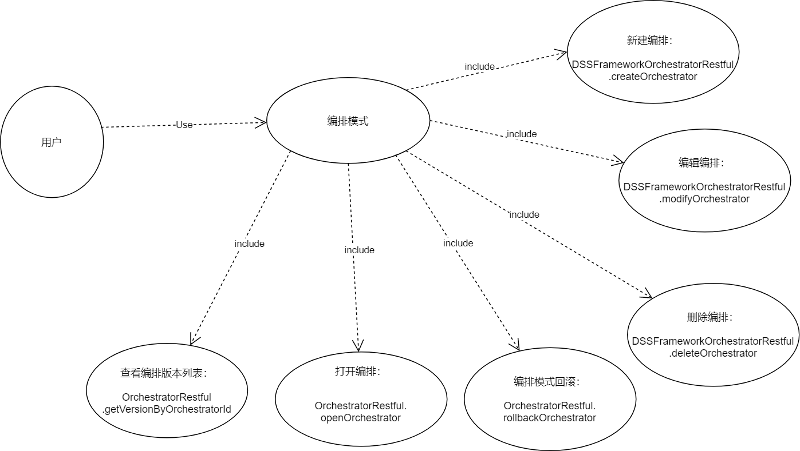
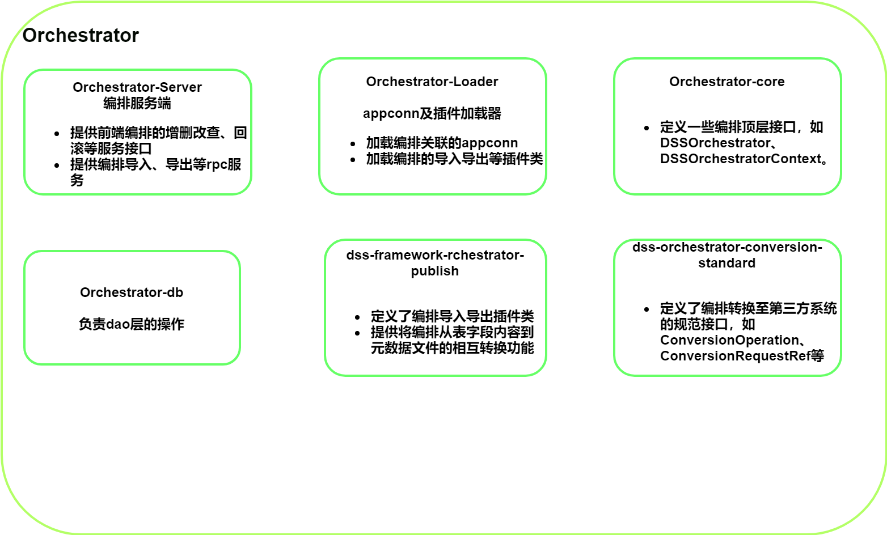
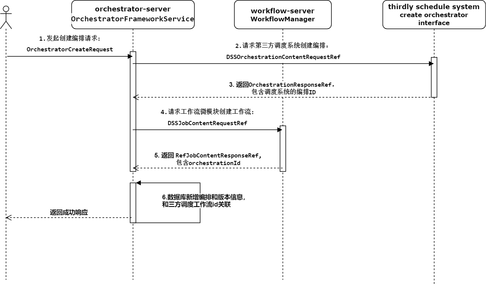

Orchestrator架构设计
-------------------------
Orchestrator：编排模块，提供project下编排的增删改查、导入导出等接口服务，并作为各个编排实现（如workflow）的统一输入端。向上对接project服务，向下对接具体编排实现（如workflow服务）。

###2.2 业务架构
用户使用功能点：


| 组件名            |   一级模块            | 二级模块          |  功能点         |
|---------------------|------------------|-----------------|-----------------|
| DataSphereStudio    | 编排模式            |  新建编排模式        |  新建一个新的编排             |
|                     |                   |   编辑编排模式        |    编辑编排的字段信息           |
|                     |                   |   删除编排模式        |   删除编排                    |
|                     |                   |   打开编排模式        | 打开编排可以进行编排节点的拖拽开发    |
|                     |                   |   查看编排版本列表     | 查看编排模式的历史版本，可以打开查看某版本，或者回滚某个版本   |
|                     |                   |   编排模式回滚        |  回滚到编排的某个历史版本（编排发布后会增加一个版本）   |



### 一、Orchestrator架构：


### 二、Orchestrator模块设计：
二级模块核心类介绍：

**dss-orchestrator-core**

Orchestrator核心模块，定义了DSSOrchestrator、DSSOrchestratorContext、DSSOrchestratorPlugin等顶层接口。

| 核心顶层接口/类              | 核心功能                            |
|---------------------------|------------------------------|
| DSSOrchestrator           | 定义了编排的属性获取方法，如获取编排名、关联的appconn、上下文信息等      |
| DSSOrchestratorContext    | 定义了orchestrator的上下文信息，提供了获取编排的插件类等方法         |
| DSSOrchestratorPlugin     | 编排插件的顶级接口，定义了init方法，子类包含导入导出的插件实现类         |
| DSSOrchestratorRelation   | 定义了编排的关联属性获取方法，如获取编排模式、获取编排关联的appconn      |

**dss-orchestrator-db**

定义了编排的dao层方法统一入口。

**dss-orchestrator-conversion-standard**

定义了编排转换至第三方系统的接口规范，包含ConversionOperation、ConversionRequestRef、ConversionService等顶层接口。
Orchestrator核心模块，定义了DSSOrchestrator、DSSOrchestratorContext、DSSOrchestratorPlugin等顶层接口。

| 核心接口/类                 | 核心功能                                 |
|---------------------      |------------------------------------------|
| ConversionOperation       | 定义了转换核心convert方法，入参为ConversionRequestRef，返回ResponseRef    |
| DSSToRelConversionRequestRef   | 定义了转换请求的基本参数，如userName、workspace、dssProject等信息    |
| ConversionIntegrationStandard    | 定义了如下核心方法：getDSSToRelConversionService（用于支持将DSS编排，转换为调度系统的工作流）  |
| ConversionService         | 定义了获取labels和获取ConversionIntegrationStandard的方法            |


**dss-orchestrator-loader**

用于加载编排关联的appconn，如workflow-appconn，以及加载DSSOrchestratorPlugin的子类，如ExportDSSOrchestratorPlugin。

| 核心接口/类               | 核心功能                                 |
|---------------------      |---------------------------------------------|
| OrchestratorManager       | 定义了getOrCreateOrchestrator方法用于加载orchestrator关联的appconn，第一次加载完会缓存，避免重复加载 |
| LinkedAppConnResolver   | 定义了根据用户获取appconn的接口 |
| SpringDSSOrchestratorContext    | 类的初始化方法会加载DSSOrchestratorPlugin的所有子类，缓存在内存中 |

**dss-framework-orchestrator-server**

Orchestrator框架服务，提供了编排前端的增删改查、回滚等接口，以及编排导入导出等rpc服务。

**dss-framework-orchestraotr-publish**

提供发布相关的插件，如编排导入导出实现类，编排压缩包生成以及解析实现类。

| 核心接口/类               | 核心功能                                 |
|---------------------      |---------------------------------------------|
| ExportDSSOrchestratorPlugin       | 定义了编排导出接口 |
| ImportDSSOrchestratorPlugin       | 定义了编排导入接口 |
| MetaWriter            | 提供将编排的表字段信息通过特定格式输出到元数据文件的功能|
| MetaReader            | 提供将编排的元数据文件解析生成表字段内容的功能|

####创建编排时序图（删除和编辑操作类似）：



####导入编排时序图（导出操作类似）：


### 数据结构/存储设计
编排信息表：
```roomsql
CREATE TABLE `dss_orchestrator_info` (
`id` bigint(20) NOT NULL AUTO_INCREMENT,
`name` varchar(255) NOT NULL COMMENT '编排名称',
`type` varchar(255) NOT NULL COMMENT '编排类型，如：workflow',
`desc` varchar(1024) DEFAULT NULL COMMENT '描述',
`creator` varchar(100) NOT NULL COMMENT '创建者',
`create_time` datetime DEFAULT NULL COMMENT '创建时间',
`project_id` bigint(20) DEFAULT NULL COMMENT '工程id',
`uses` varchar(500) DEFAULT NULL COMMNET '用途',
`appconn_name` varchar(1024) NOT NULL COMMENT '编排关联的appconn，如workflow',
`uuid` varchar(180) NOT NULL COMMENT 'uuid',
`secondary_type` varchar(500) DEFAULT NULL COMMENT '编排第二类型，如workflow-DAG',
`is_published` tinyint(1) NOT NULL DEFAULT '0' COMMENT '是否已发布',
`workspace_id` int(11) DEFAULT NULL COMMENT '工作空间id',
`orchestrator_mode` varchar(100) DEFAULT NULL COMMENT '编排模式，取得的值是dss_dictionary中的dic_key(parent_key=p_arrangement_mode)',
`orchestrator_way` varchar(256) DEFAULT NULL COMMENT '编排方式',
`orchestrator_level` varchar(32) DEFAULT NULL COMMENT '工作流级别',
`update_user` varchar(100) DEFAULT NULL COMMENT '更新人',
`update_time` datetime DEFAULT CURRENT_TIMESTAMP COMMENT '更新时间',
PRIMARY KEY (`id`) USING BTREE,
UNIQUE KEY `unique_idx_uuid` (`uuid`)
) ENGINE=InnoDB DEFAULT CHARSET=utf8mb4 ROW_FORMAT=COMPACT;
```

编排版本信息表：
```roomsql
CREATE TABLE `dss_orchestrator_version_info` (
  `id` bigint(20) NOT NULL AUTO_INCREMENT,
  `orchestrator_id` bigint(20) NOT NULL COMMENT '关联编排id',
  `app_id` bigint(20) DEFAULT NULL COMMENT '编排实现的id，如flowId',
  `source` varchar(255) DEFAULT NULL COMMENT '来源',
  `version` varchar(255) DEFAULT NULL COMMENT '版本号',
  `comment` varchar(255) DEFAULT NULL COMMENT '描述',
  `update_time` datetime DEFAULT NULL COMMENT '更新时间',
  `updater` varchar(32) DEFAULT NULL COMMENT '更新者',
  `project_id` bigint(20) DEFAULT NULL COMMENT '工程id',
  `content` varchar(255) DEFAULT NULL COMMENT '',
  `context_id` varchar(200) DEFAULT NULL COMMENT '上下文ID',
  `valid_flag` INT(1) DEFAULT '1' COMMENT '版本有效标示，0:无效；1：有效',
  PRIMARY KEY (`id`) USING BTREE
) ENGINE=InnoDB DEFAULT CHARSET=utf8mb4 ROW_FORMAT=COMPACT;
```

和调度系统编排关联表：
```roomsql
CREATE TABLE `dss_orchestrator_ref_orchestration_relation` (
  `id` bigint(20) NOT NULL AUTO_INCREMENT COMMENT '主键ID',
  `orchestrator_id` bigint(20) NOT NULL COMMENT 'dss的编排模式id',
  `ref_project_id` bigint(20) DEFAULT NULL COMMENT '调度系统关联的工程Id',
  `ref_orchestration_id` int(11) DEFAULT NULL COMMENT '调度系统工作流的id（调用SchedulerAppConn的OrchestrationOperation服务返回的orchestrationId）',
  PRIMARY KEY (`id`)
) ENGINE=InnoDB DEFAULT CHARSET=utf8mb4 ROW_FORMAT=COMPACT;
```

###5.接口设计


###6.非功能性设计
####6.1 安全
采用cookie中专门的ID,在GateWay需要使用专门的解密算法后才能识别。
####6.2 性能
可以满足性能要求。
####6.3 容量
不涉及
####6.4 高可用
可部署多活
 