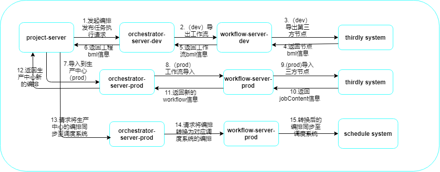

## 工作流发布设计

## 一、概述

在实际的生产应用中，开发中心负责对业务相关的工作流做调试，当调试完成之后，会把工作流发布到调度系统做定时批量调度作业，实现业务自动化。

### 二、工作流发布架构设计

工作流的发布是一个相对复杂的过程，其中涉及到工作流的导入、导出以及发布等功能。

##### 1、发布流程调用链路图：

##### 2、重要步骤说明

- 导出：从开发中心(dev)导出，包括工作流和第三方节点导出。通过bml服务将生成的工作流json文件压缩成zip包上传到bml文件服务中心。
- 导入：导入到生产中心(prod)。下载保存在bml文件服务中心的的zip文件，并对json文件进行解析，获取工作流编排信息，并保存到数据库。
- 发布：将导入获取到的dss工作流编排信息转换成调度系统可用的工作流编排信息，压缩成zip包，发布到wtss调度系统。
