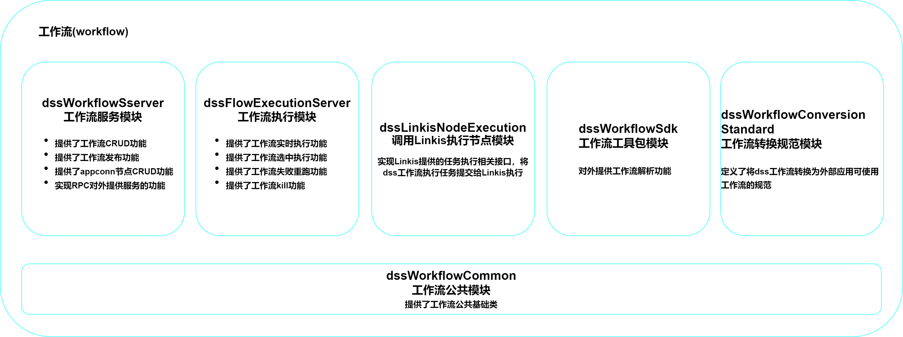

## DSS工作流(workflow)架构设计

工作流(workflow)：指“业务过程的部分或整体在计算机应用环境下的自动化”。是对工作流程及其各操作步骤之间业务规则的抽象、概括描述。通过使用工作流可以给数据开发工作带来极大的便利。

### 一、工作流架构

### 二、二级模块介绍

##### dss-workflow-server

工作流核心模块，包括工作流CRUD功能，工作流发布功能，工作流appconn节点的CRUD功能，工作流cs服务功能，以及PPC对外提供服务功能。

| 核心service     | 核心功能 |
| ------------------- | -------- |
| DSSFlowService      | 包含了工作流及子工作流CRUD，以及工作流版本管理等方法        |
| WorkflowNodeService | 包含工作流节点CRUD、copy、import、export等方法       |
| PublishService    | 提供工作流发布相关功能 |
| DSSWorkflowReceiver  | PRC任务调用接收器 |
| DSSWorkflowChooser | PRC任务调用选择器 |

##### dss-flow-execution-server

工作流执行模块，包含工作流执行的相关功能，包括工作流的实时执行、选中执行、失败重跑、工作流kill等功能。

##### dss-workflow-sdk

工作流工具包模块，对外提供工作流资源文件解析功能。

| 核心类           | 核心功能                                     |
| ---------------- | -------------------------------------------- |
| FlowToJsonParser | 用于将一个flow解析为DSS可以使用的DSSJsonFlow |
| json2flow        | 用于将工作流json解析为需要的工作流对象       |

##### dss-workflow-common

工作流基础公共模块，将公共实体类抽象出来，保存在此模块当中。

##### dss-linkis-node-execution

dss调用linkis执行节点模块，实现了linkis提供的任务执行相关接口。

| 核心类                  | 核心功能                                                     |
| ----------------------- | ------------------------------------------------------------ |
| LinkisNodeExecution     | 包含任务运行、任务状态、任务结果、任务取消、任务日志等核心方法 |
| LinkisExecutionListener | 监听任务执行情况                                             |
| DefaultRetryHandler     | 提供重试机制                                                 |

##### dss-workflow-conversion-standard

工作流转换规范模块，定义了将DSS的工作流转换为其他外部应用可以使用的工作流的规范。

| 核心类                                | 核心功能       |
| ------------------------------------- | -------------- |
| ProjectConversionIntegrationStandard  | 工程转换规范   |
| WorkflowConversionIntegrationStandard | 工作流转换规范 |

